# Building Maclock

This guide covers hardware assembly, wiring, firmware preparation, and
flashing. See [README.md](README.md) for the software manual and operating
instructions.

## Safety

- Disconnect USB power and any battery before opening, cutting, soldering, or
  rewiring the device.
- Wear eye protection when cutting plastic and provide ventilation while
  soldering.
- Insulate every joint, remove loose wire strands, and check for shorts before
  applying power.
- The display flex and its solder pads are fragile. Work slowly and support the
  cable while soldering.

## Parts And Tools

The recommended controller/display is the
[2.8inch ESP32-S3 Display](https://www.lcdwiki.com/2.8inch_ESP32-S3_Display).

The completed clock also uses:

- A Maclock enclosure and its original front controls.
- A 3.3 V-compatible DS1307 or DS3231 RTC.
- A 3.3 V-compatible HTU2x or BMP580/BMP581 weather sensor.
- A discrete touch sensor for wake and emulator mouse clicks.
- Hookup wire and a roughly 10 cm display-wire extension.
- A USB extension/breakout that fits the enclosure.
- Soldering and desoldering tools, a multimeter, cutters, and opening picks.

| RTC and weather-sensor modules | USB connector parts |
| --- | --- |
| 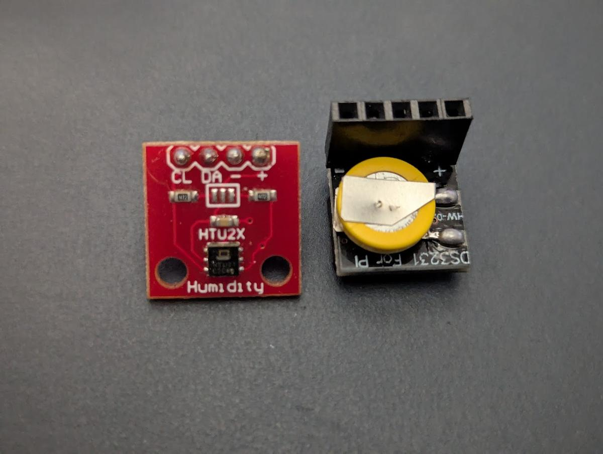 | 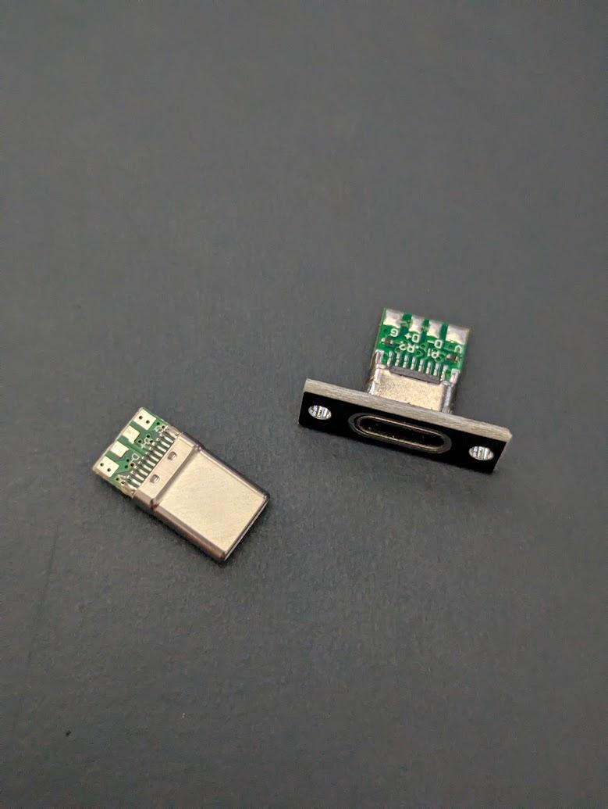 |

## Electrical Connections

All external devices share **GND** and must be compatible with 3.3 V logic.
Pin assignments are defined by `platformio.ini`.

| Component | GPIO |
| --- | --- |
| Encoder CLK | GPIO 14 |
| Encoder DT | GPIO 21 |
| I²C SDA | GPIO 16 |
| I²C SCL | GPIO 15 |
| Touch Sensor (red wire) | GPIO 2 |
| Floppy Switch | GPIO 47 (SD connector pad 2) |
| Alarm Button | GPIO 40 (SD connector pad 3) |
| Clock Button | GPIO 48 (SD connector pad 1, exterior) |

The I²C bus is shared with the onboard ES8311 audio codec (`0x18`) and FT6336G
touch controller (`0x38`). Supported external devices are:

| Address | Device |
| --- | --- |
| `0x40` | HTU2x temperature/humidity sensor |
| `0x47` | BMP580/BMP581 pressure/temperature sensor |
| `0x68` | DS1307 or DS3231 real-time clock |

## Physical Assembly

### 1. Open The Enclosure

Disconnect all power. Work opening picks around the enclosure seam and separate
the front carefully so the original wiring is not pulled or cut.

  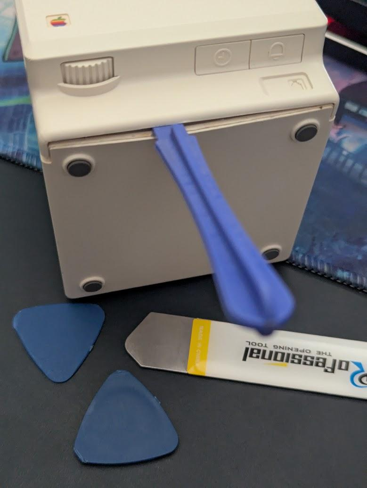

### 2. Make Room For The Display

Remove only the internal plastic supports that interfere with the new display.
Dry-fit the panel repeatedly and keep the exterior bezel intact.

  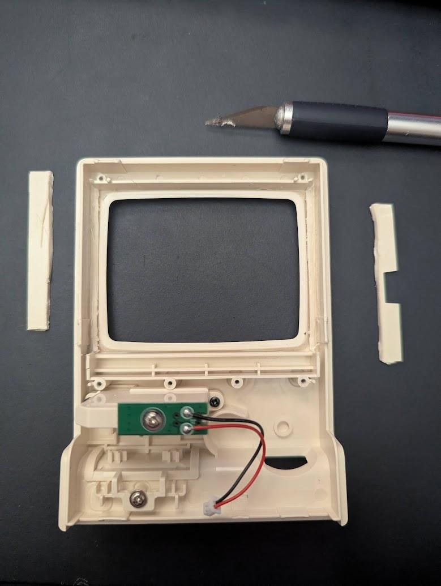

### 3. Extend The Display Connection

Separate the LCD from the controller board carefully. Desolder the display
connection, add a roughly 10 cm wire extension, and reconnect each conductor in
the same order. Check every line for continuity and adjacent-pin shorts.

  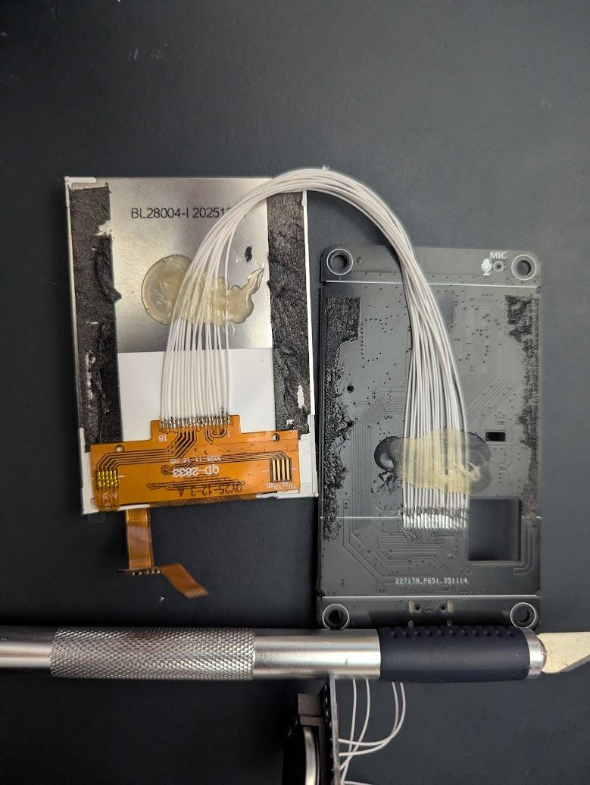

### 4. Connect The I²C Bus

Connect the external sensor and RTC bus to SDA GPIO 16 and SCL GPIO 15, with
3.3 V and ground as required by the modules. Keep the leads short and secure
them so enclosure movement cannot stress the board pads.

  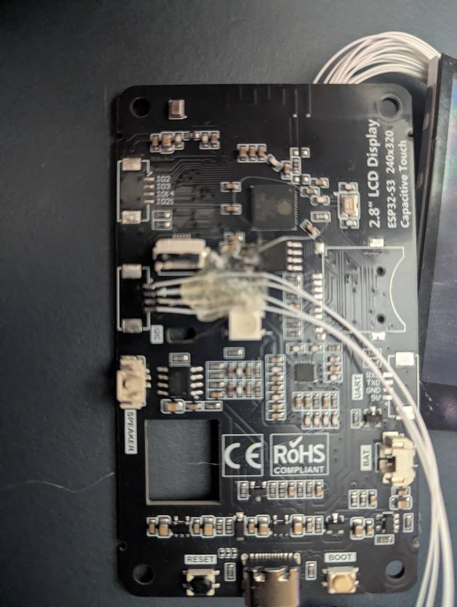

### 5. Reuse The Original Controls

Connect the original front-control board to the encoder and button GPIOs. Route
and secure the wires so the mechanism and case screws cannot pinch them.

  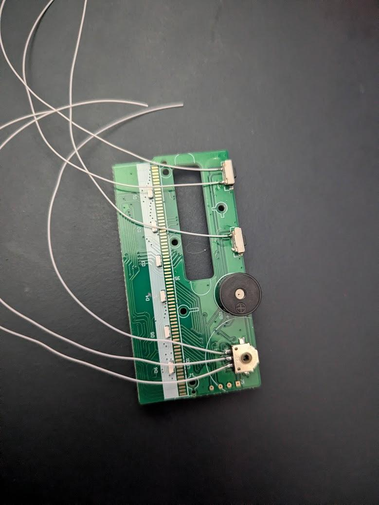

### 6. Connect The Switch Inputs

Wire the floppy, alarm, and clock inputs to the SD-connector pads listed in the
pin table. Confirm the pad numbering against the board before soldering.

  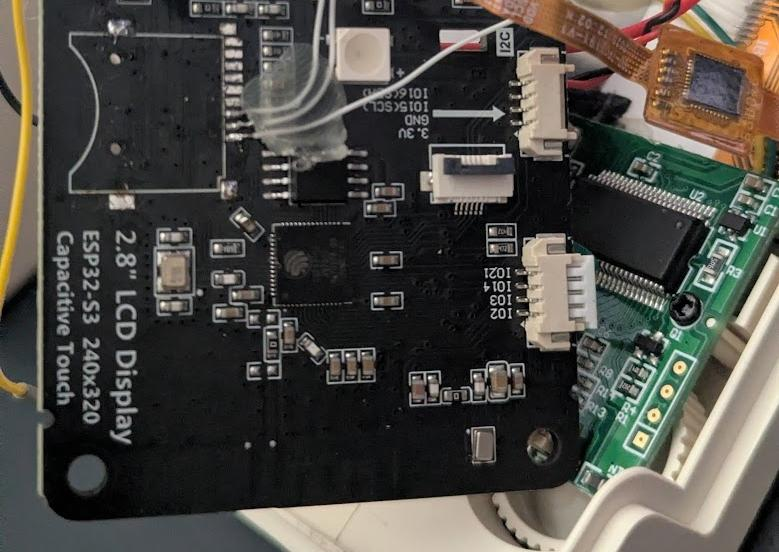

### 7. Install The USB Extension

Mount the USB connector where it remains accessible after assembly. Provide
strain relief, insulate the terminals, and verify polarity before connecting
the ESP32-S3.

  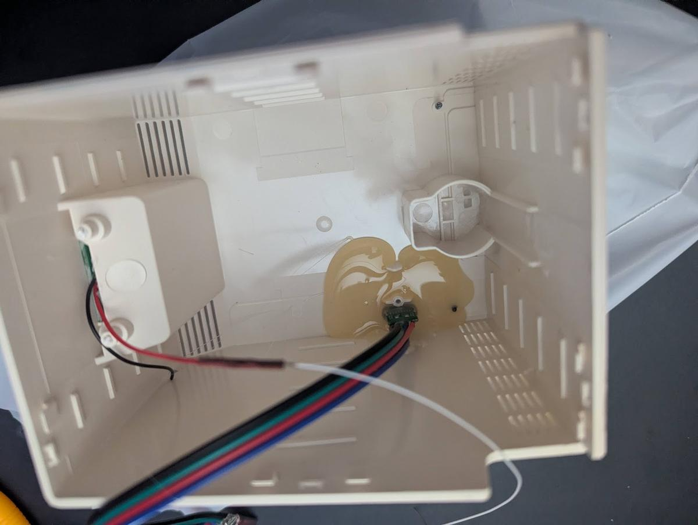

### 8. Arrange And Close The Case

Dry-fit the screen and boards, secure every module, and keep wiring clear of
case posts and the display. Test continuity once more before closing the
enclosure.

  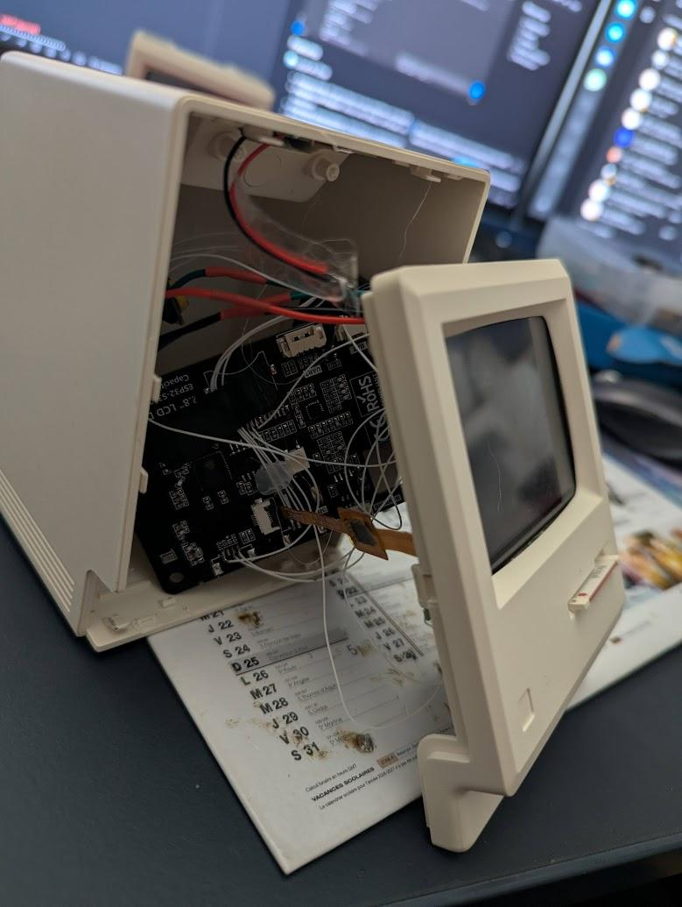

The rear USB connection remains accessible on the completed build.

  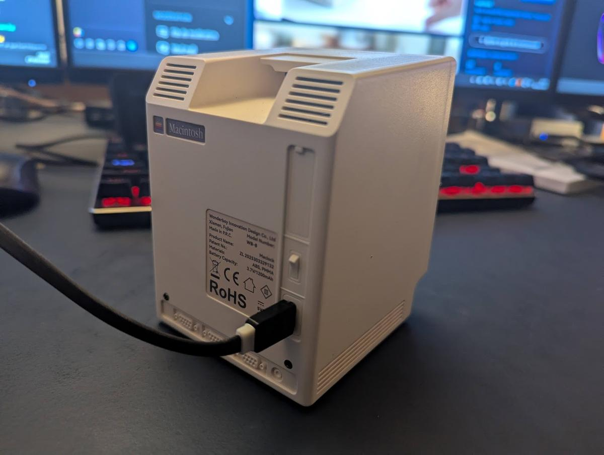

## Firmware Preparation

1. Install Visual Studio Code.
2. Install the PlatformIO IDE extension.
3. Open this repository in Visual Studio Code and let PlatformIO initialize the
   environment.
4. Run `./prepare.sh` once in a fresh checkout.

`prepare.sh` downloads and extracts the Mini vMac source, applies the tracked
patches, and downloads initial ROM/disk inputs when they are absent. Review the
script and use only ROMs and software that you are legally entitled to use.

The generated `src/minivmac/` tree, downloaded archives, ROM, and `disk*.dsk`
files are deliberately excluded from Git.

## Build And Upload

In PlatformIO:

- **PlatformIO: Upload** builds and uploads the firmware.
- **PlatformIO: Upload Filesystem Image** builds `data/` and uploads LittleFS.

Firmware and filesystem uploads are separate. Uploading firmware does not
update images, audio, ROMs, or disks. Uploading LittleFS can overwrite mutable
Mini vMac disks and their saved data, so preserve host-side backups before
using `uploadfs`.

## LittleFS Contents

The `data/` directory is packaged into LittleFS:

- Tracked PNG and MP3 assets implement the clock interface.
- `vMac.ROM` supplies the Macintosh Plus ROM.
- Sequential `disk1.dsk`, `disk2.dsk`, and later images supply Mini vMac disks.

Mini vMac stops mounting disks at the first missing number. Keep disk names
contiguous.

## First Power-On Checks

Before closing the project:

1. Start the serial monitor at 115200 baud.
2. Confirm the ES8311 (`0x18`) and FT6336 (`0x38`) are present.
3. Confirm one supported weather sensor and the RTC are detected.
4. Test the encoder, Clock button, floppy switch, and discrete touch sensor.
5. Open Boot Options and perform the four-point touchscreen calibration.
6. Verify clock mode, MP3 playback, and the temperature/gauge display.
7. If Mini vMac files are installed, verify emulator boot, pointer motion,
   mouse clicks, and disk persistence.

See [README.md](README.md#troubleshooting) for software troubleshooting and
[docs/ARCHITECTURE.md](docs/ARCHITECTURE.md) for implementation details.
