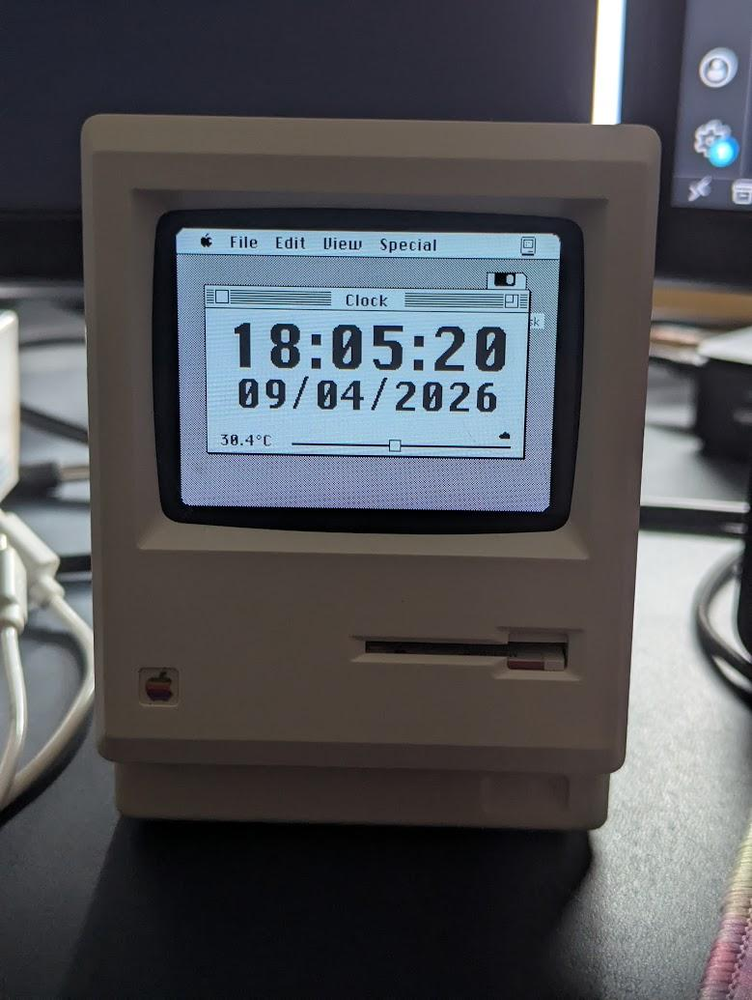
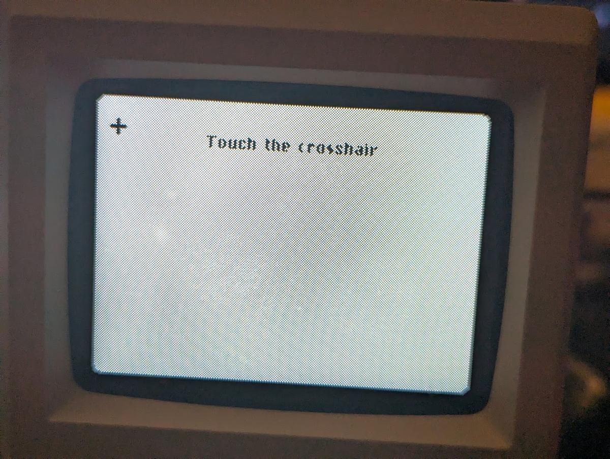
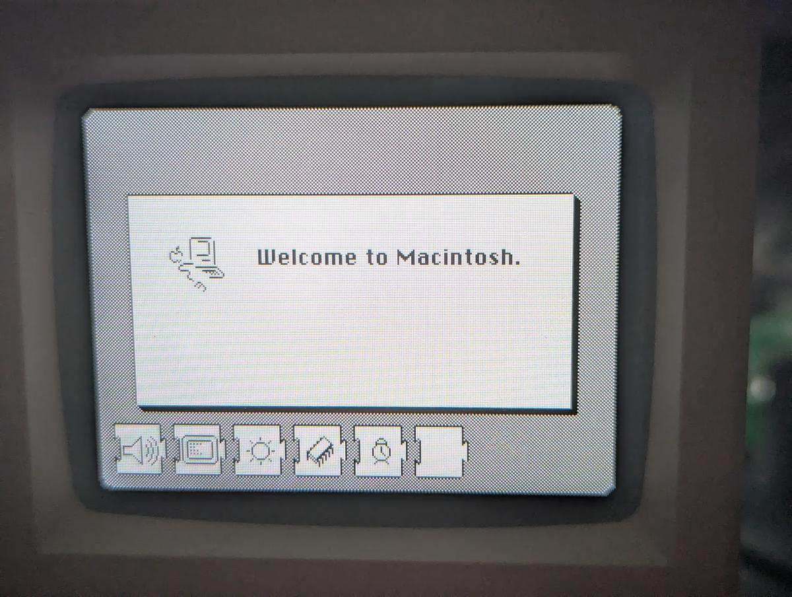
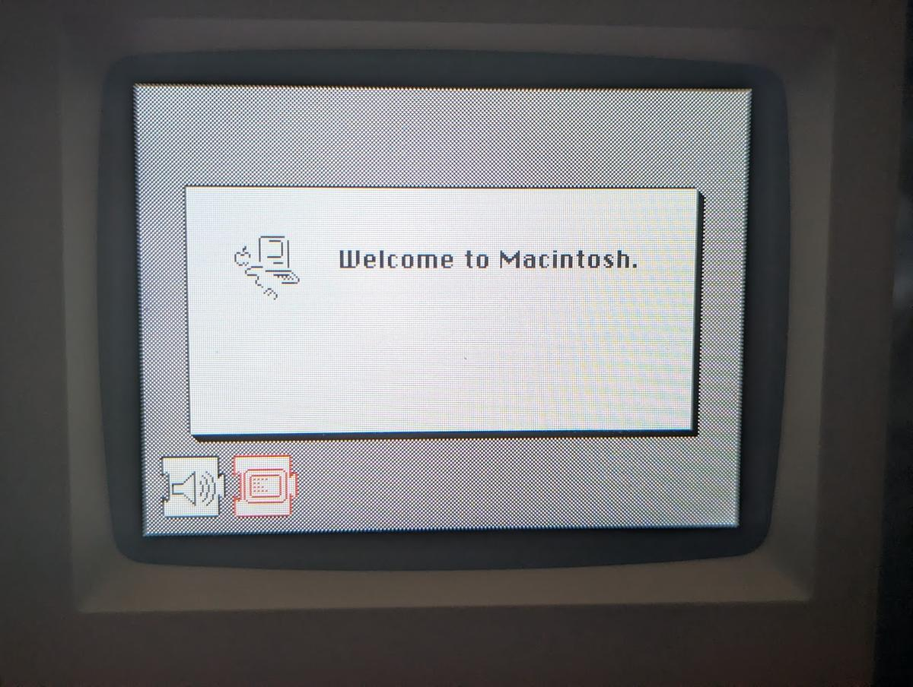
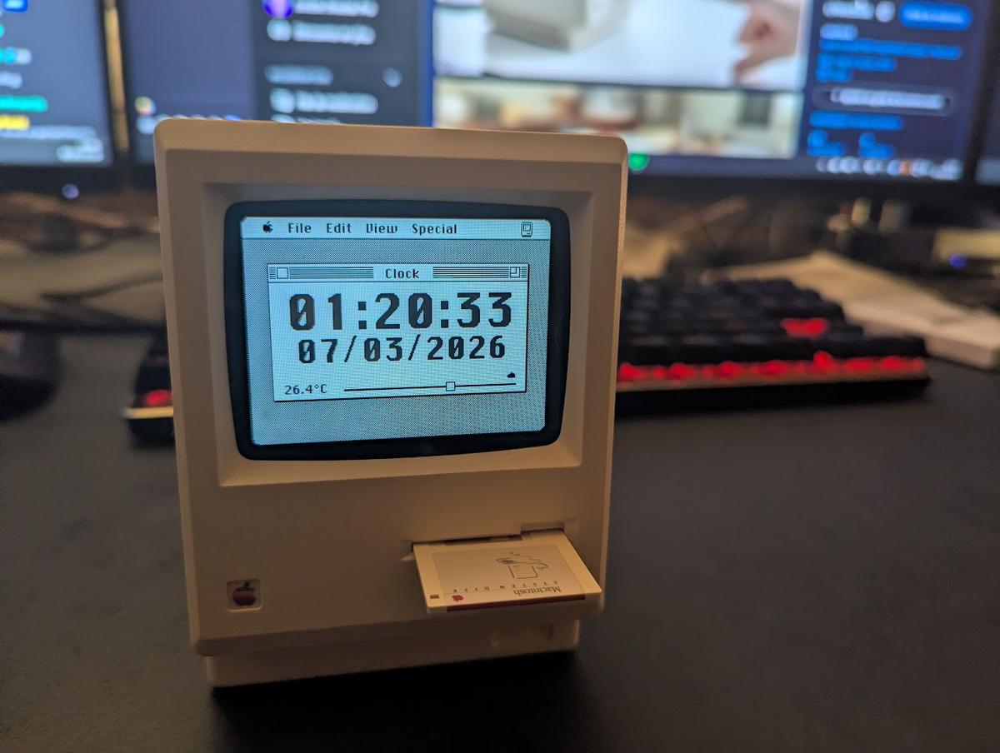
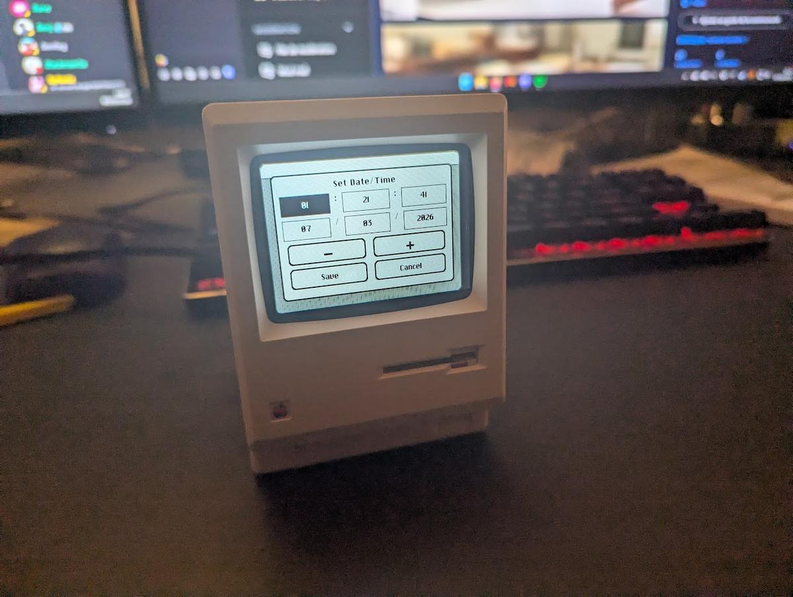
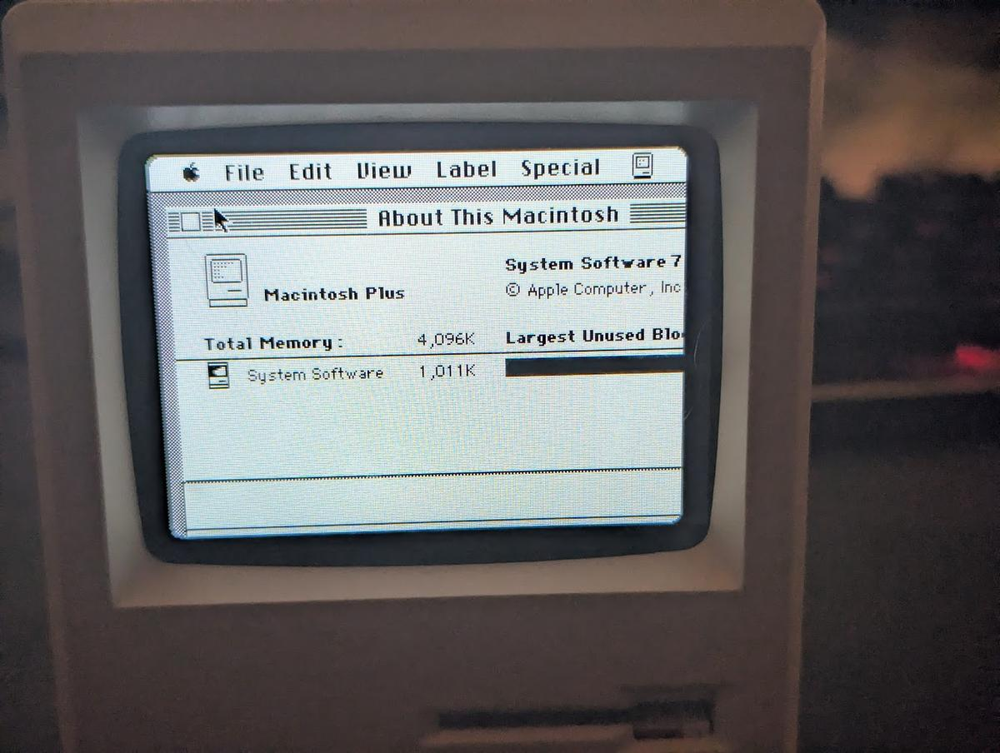
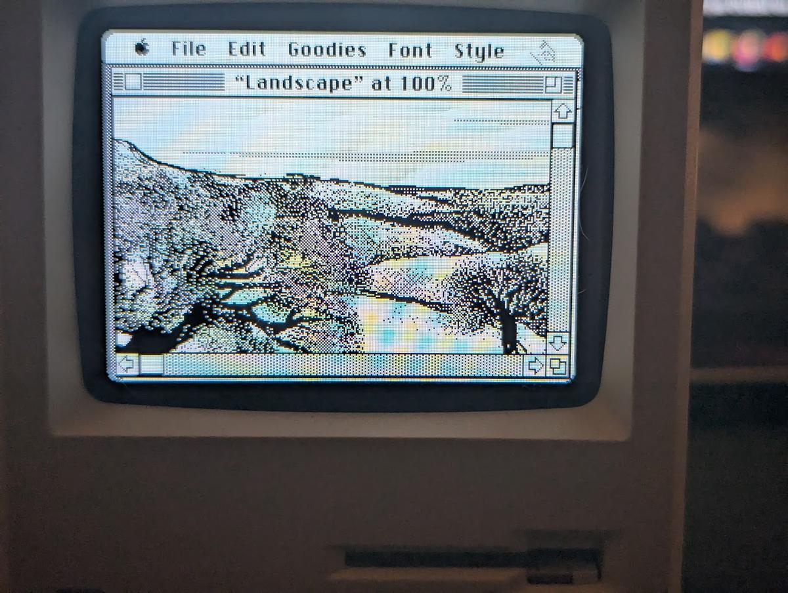

# Maclock

Maclock replaces the original Maclock screen with a 320x240 color IPS display
driven by an ESP32-S3.

The firmware has two operating modes:

- **Clock mode** presents a Macintosh-inspired clock with startup sounds,
  date/time editing, weather data, touch calibration, and adjustable
  brightness.
- **Mini vMac mode** emulates a Macintosh Plus from ROM and disk images stored
  in LittleFS.

  

## Discord

Join the community on the [Discord server](https://discord.gg/89etSPMFym).

## Build Your Own

See the illustrated [BUILD.md](BUILD.md) guide for required hardware,
disassembly, wiring, firmware preparation, and flashing.

## Software Manual

### Controls

| Control | Clock mode | Mini vMac mode |
| --- | --- | --- |
| Rotary encoder | Adjust brightness from off to maximum | Adjust brightness from off to maximum |
| Clock button | Open the date/time editor; dismiss a ringing alarm; wake night mode | Enter key |
| Alarm button | Open alarms and timers; snooze a ringing alarm; wake night mode | Escape key |
| Clock + Alarm, held for 2 seconds | Open Boot Options | Safely exit to Boot Options |
| Floppy switch | Advance startup and show the floppy icon | No emulator action |
| Display touchscreen | Operate menus, show the pointer, and wake night mode | Move the Macintosh pointer using relative motion |
| Discrete touch sensor (red wire) | Force full brightness for 10 seconds; snooze a ringing alarm | Macintosh mouse button |

Brightness uses perceptual steps, so the lower levels change more gradually.
Brightness, night-mode settings, the optional default boot mode, and
touchscreen calibration are stored persistently.

### Choosing The Boot Mode

Maclock can start either the clock or Mini vMac, regardless of the physical
floppy-switch position. The saved default determines which mode starts at
power-on.

To open the boot-options screen:

1. From the normal clock screen, hold **Clock** and **Alarm** together for two
   seconds; or
2. Turn Maclock off, hold **Clock**, turn Maclock on, and release the button
   when **Boot Options** appears.

Boot Options uses ten pages with large controls. Its first page has
rounded-square **Clock** and **Emulator** launch buttons. Every page has fixed
**Previous**, **Exit**, and **Next** footer slots; the unavailable direction
is left empty on the first or last page. The pages cover Start, Preferences,
two Night pages, four Chime pages, Wi-Fi, and Tools:

- **Brightness / Latest** restores the last encoder brightness.
- **Brightness / Lowest** starts at the lowest visible setting.
- **Brightness / Highest** starts at full brightness.
- **Clock** runs the normal Macintosh-style clock startup.
- **Emulator** launches Mini vMac immediately.
- **Remember** saves the selected start mode as the next power-on default;
  **One time** starts it without changing the default.
- **Diagnostics** opens a live hardware test screen for both buttons, the
  floppy switch, encoder, touch sensor, charging input, known I²C devices, and
  RTC health.
- **Exit** returns directly to the normal clock from any page.

The brightness choice is saved as it is changed. The boot mode is saved only
when **Remember** is selected.

### Scheduled Night Mode

Night mode is configured on the two Night pages in **Boot Options**:

1. Enable the schedule and select the hours to start dimming and return to
   normal brightness.
2. Choose **Dim only** to keep the display at its lowest visible brightness,
   or **Screen off** and select the hour when the backlight should turn off.

The screen-off hour must fall inside the configured night interval. The clock,
timers, and alarms continue running while the backlight is off. A touchscreen
press, the discrete touch sensor, or either physical button restores full
brightness for 10 seconds. The first Clock or Alarm press while night mode is
dimmed or off is used only to wake the display; press it again to open its
screen. A ringing alarm or finished timer also restores the normal display.

### Hourly Chime

The four Chime pages in **Boot Options** configure:

- **Off**, **Hourly**, or **Quarter hour** playback. Quarter-hour mode plays
  at `:00`, `:15`, `:30`, and `:45`.
- Any `.mp3` file stored in LittleFS. Select a file and tap **Play** to
  preview it at a reduced, distortion-safe volume.
- 25%, 50%, 75%, or 100% volume.
- Optional quiet hours, including schedules that cross midnight.

Chime settings are saved immediately. A due chime is skipped during quiet
hours or while an alarm, timer, startup effect, or other sound is already
playing.

### Optional Wi-Fi Mode

Wi-Fi is disabled by default, and the RTC, alarms, timers, night mode, and
local weather sensor continue to work without a network.

To configure it:

1. Open the **Wi-Fi** page in Boot Options and choose **Setup Wi-Fi**.
2. Connect a phone or computer to the `Maclock Setup` access point.
3. Open `http://192.168.4.1` if the setup page does not appear automatically.
4. Enter the Wi-Fi name, password, and city, then save.
5. Return to Maclock and press **Back**.

When enabled and connected, Maclock:

- synchronizes the external RTC from NTP;
- obtains the city coordinates and automatic UTC/DST offset;
- refreshes the current conditions, daily low/high, and rain probability;
- pauses its Wi-Fi worker while Mini vMac is running.

The clock switches back to its local BMP5xx/HTU2x display if the online
forecast becomes stale or cannot be reached. The last synchronized RTC time
continues normally while offline. A DST change that happens during a long
offline period is applied after the next successful connection.

City lookup and weather use the
[Open-Meteo Geocoding API](https://open-meteo.com/en/docs/geocoding-api) and
[Forecast API](https://open-meteo.com/en/docs). Wi-Fi credentials and the city
are stored in the device's persistent settings.

### Calibrating The Touchscreen

Calibration is entered from the boot-options screen:

1. Open **Boot Options** as described above.
2. Release the Clock button.
3. Press the **Clock** button again.
4. Touch and release each crosshair in order:
   top-left, top-right, bottom-right, and bottom-left.

After the fourth point, the calibration is saved and Maclock opens the normal
clock display. Press **Clock** during calibration to cancel and return to Boot
Options without changing the saved calibration.

  

### Clock Startup

Clock mode follows a Macintosh-style startup sequence:

1. The background appears and `startup.mp3` plays.
2. Missing-disk images alternate while Maclock waits for the floppy switch.
3. Activating the switch plays `floppy.mp3`.
4. Maclock checks the expected I²C plugins and reveals their icons.
5. If all required devices are present, the normal clock appears.

The startup diagnostic expects:

| Address | Device |
| --- | --- |
| `0x18` | ES8311 audio codec |
| `0x38` | FT6336 touchscreen |
| `0x40` or `0x47` | HTU2x or BMP580/BMP581 weather sensor |
| `0x68` | DS1307 or DS3231 real-time clock |

| Successful plugin detection | Missing-plugin diagnostic |
| --- | --- |
|  |  |

A missing expected device is shown in red and blinks continuously. This is a
deliberate diagnostic stop; correct the connection and restart Maclock. Serial
output at 115200 baud reports RTC and weather-sensor detection details.

### Using The Clock

The main screen displays:

- Time and date from the external RTC.
- When online, current temperature, daily low/high, rain probability, and a
  forecast icon.
- When offline, temperature plus a weather icon and gauge derived from the
  detected pressure or humidity sensor.
- A small floppy icon while the floppy switch is active.

When a BMP580/BMP581 is installed, the gauge represents atmospheric pressure.
When an HTU2x is installed, it represents relative humidity. If both are
connected, the BMP5xx is preferred.

Rotate the encoder to change the backlight. The selected value is saved after a
short delay. Touching the discrete red-wire sensor temporarily sets the
backlight to maximum.

Touching the display shows a Macintosh pointer, which automatically disappears
after two seconds.

  

### Setting Alarms

Press the **Alarm** button from the main clock screen to configure up to three
alarms. Each alarm has its own:

- Enabled setting.
- Hour and minute.
- Monday-through-Sunday schedule.
- Sound: any `.mp3` file stored in LittleFS, with a **Play** button for
  previewing it at a reduced, distortion-safe volume.
- Volume: 25%, 50%, 75%, or 100%.

The first page has large square **Alarm** and **Timer** buttons.
Alarm opens six pages with large touch targets: alarm selection, time, days,
sound, volume, and actions. Every page has fixed **Previous**, **Exit**, and
**Next** footer slots, leaving an empty direction on the first and last pages.
The four time buttons always adjust the selected alarm by exactly one hour or
one minute. Tap **Save** on the last page to store all three alarms
persistently. **Exit** discards changes made since opening the editor.

An alarm-clock icon appears to the left of the date when at least one alarm is
enabled or snoozed. When an alarm rings, press **Alarm**, touch the discrete
red-wire sensor, or tap **Snooze 9 min** to snooze it. Press **Clock** or tap
**Dismiss** to stop it for the current occurrence.

### Using The Timer

1. Press **Alarm** from the main clock screen.
2. Tap **Timer** on the first page.
3. Adjust the duration with **-10**, **-1**, **+1**, and **+10**.
4. Tap **Start**.

The duration is limited to 1–99 minutes.

The timer returns to the normal clock and continues counting down in the
background. While it is active, its remaining time replaces the date on the
main clock. Opening the timer dialog again shows the live countdown and
provides **Stop**, **Start** to restart with the selected duration, and
**Back**.

When the countdown reaches zero, a Macintosh-style completion dialog appears
and the timer sound repeats. Tap **Dismiss**, or press either **Clock** or
**Alarm**, to return to the normal clock.

### Setting The Date And Time

1. Press the **Clock** button from the main screen.
2. Tap the hour, minute, second, day, month, or year field.
3. Use **-** and **+** to change the selected value. Hold a button to repeat.
4. Tap **Save** to write the value to the RTC, or **Cancel** to discard it.

  

Supported RTCs are DS1307 and DS3231 at I²C address `0x68`. Without a working
RTC, the firmware falls back to `01/01/2000 00:00:00`, and the startup plugin
diagnostic will not complete. Boot Options and Diagnostics also warn when a
DS1307 is stopped, a DS3231 reports lost power, the date is invalid, or the
year is earlier than 2024. A healthy RTC does not add a status line to Boot
Options. If the date returns to 2000 after unplugging Maclock, check or replace
the RTC backup battery, then set the date again.

### Using Mini vMac

Mini vMac mode emulates a Macintosh Plus with a 304x224 monochrome desktop
inside the physical 320x240 display.

| About This Macintosh | MacPaint |
| --- | --- |
|  |  |

The LittleFS image must contain:

- `vMac.ROM`, a compatible 128 KiB Macintosh Plus ROM.
- `disk1.dsk`, the first bootable disk image.
- Optional sequential images named `disk2.dsk`, `disk3.dsk`, and so on.

Maclock stops looking for disks at the first missing number and supports up to
six mounted images. For example, `disk1.dsk` and `disk3.dsk` without
`disk2.dsk` will mount only `disk1.dsk`.

To start the emulator, open Boot Options and tap **Start Emulator**. To make it
the normal power-on mode, select **Remember** before starting it. The physical
floppy switch can be either active or inactive.

Move a finger on the display to move the Macintosh pointer. Use the discrete
red-wire touch sensor as the mouse button. In the emulator, the **Clock** button
acts as **Enter**, the **Alarm** button acts as **Escape**, and the rotary
encoder adjusts and saves the display brightness. A control reminder is shown
over the emulated screen for four seconds after startup.

Hold **Clock** and **Alarm** together for two seconds to safely eject and close
the mounted disk images, stop Mini vMac, and return to Boot Options. Macintosh
mono sound plays through the ES8311 speaker output.

Disk images are opened read/write when possible, so changes made inside the
emulated Macintosh persist in LittleFS. Keep backup copies of important disk
images. Uploading a new LittleFS image can replace the on-device disks and
their changes.

### Adding Macintosh Software

1. In Infinite Mac, open
   [System 7.0 at 320x240](https://infinitemac.org/1991/System%207.0?screenSize=320x240)
   and copy the desired software to the **Saved HD** drive.
2. Export the Saved HD image from the Infinite Mac settings.
3. Download a blank disk image from the
   [Mini vMac blanks page](https://www.gryphel.com/c/minivmac/extras/blanks/).
4. Open the blank image in
   [Mini vMac](https://www.gryphel.com/c/minivmac/download.html), then open the
   exported Infinite Mac disk image.
5. Copy the software from the exported disk to the blank disk.
6. Place the resulting image in `data/` as the next contiguous name, such as
   `disk2.dsk`.
7. Rebuild and upload LittleFS using the instructions in
   [BUILD.md](BUILD.md#build-and-upload).

Use only ROMs and software that you are legally entitled to use and distribute.

## Troubleshooting

### The missing-disk images keep alternating

The clock startup is waiting for the floppy switch. Check its GPIO 47 wiring
and activate the switch.

### A red plugin icon blinks forever

An expected I²C device did not answer. Check power, ground, SDA/SCL wiring, and
the addresses listed in the startup table. Use the 115200-baud serial monitor
for RTC and weather detection messages.

### Touches land in the wrong place

Repeat the four-point calibration from Boot Options.

### Mini vMac does not start

Confirm all of the following:

- Start it from **Boot Options**, or save Emulator as the default using
  **Remember**.
- `vMac.ROM` and `disk1.dsk` were included in the uploaded LittleFS image.
- The ROM is a compatible 128 KiB Macintosh Plus ROM.

### Images or sounds are missing

Build and upload the filesystem image. A firmware-only upload does not install
files from `data/`.

### The date resets to 2000

The RTC was not detected or initialized. Check the device, its backup battery,
I²C wiring, and address `0x68`.

## Developer Documentation

- [BUILD.md](BUILD.md): hardware construction, firmware preparation, and
  flashing.
- [docs/ARCHITECTURE.md](docs/ARCHITECTURE.md): firmware architecture.
- [AGENTS.md](AGENTS.md): repository-specific development guidance.
