# Maclock-Benutzerhandbuch

[English](manual.md) · [Français](manual.fr.md) · [Español](manual.es.md) ·
**Deutsch** · [Italiano](manual.it.md)

Dieses Handbuch erklärt die Bedienung von Maclock. Aufbau und Installation
stehen in der [Bauanleitung](BUILD.md).

## 1. Maclock kennenlernen

Maclock besitzt Touchscreen, Drehregler, zwei Fronttasten, oberen
Berührungssensor und Diskettenhebel.

| Bedienelement | Uhr | Macintosh-Emulator |
| --- | --- | --- |
| Drehregler | Helligkeit oder Navigation ohne Touchscreen | Helligkeit |
| Uhrtaste | Konfiguration, Alarm beenden, Display wecken | Eingabe |
| Alarmtaste | Alarme und Timer, Schlummern, Display wecken | Escape |
| Uhr + Alarm | Konfiguration | Emulator sicher verlassen |
| Touchscreen | Menüs und Zeiger | Zeiger bewegen |
| Oberer Sensor | Vorübergehend volle Helligkeit oder Schlummern | Mausklick |

Ohne Touchscreen bewegt der Drehregler die blinkende Auswahl; der obere Sensor
bestätigt. Auf Uhr und Bildschirmschonern regelt er die Helligkeit. Kalibrierung
und Emulator bleiben bis zum Anschließen und Neustart deaktiviert.

## 2. Erste Schritte

Maclock anschließen, beim wechselnden Diskettensymbol die Diskette einlegen und
den Start abwarten. Danach erscheint das gewählte Zifferblatt.

| Konfiguration | Macintosh-Uhr |
| --- | --- |
| 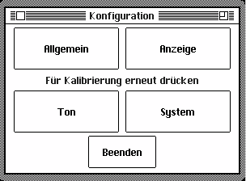 |  |

Kommt eine Startwarnung nach einem Neustart wieder, siehe
[Fehlerbehebung](TROUBLESHOOTING.md).

## 3. Konfiguration

Auf der Uhr **Uhr** drücken oder die Taste beim Einschalten halten.

- **Allgemein** — Sprache, Region, Datum und Uhrzeit.
- **Anzeige** — Zifferblätter, Darstellung, Bildschirmschoner und Nachtmodus.
- **Ton** — Glockenschlag, Klänge, Lautstärke und Ruhezeiten.
- **System** — Start, WLAN, Aktualisierungen, Werkzeuge und Über.

**Bereiche** öffnet die Bereichsauswahl, **Beenden** kehrt zur Uhr zurück.
Unter **System > Start** lässt sich Uhr oder Emulator sofort öffnen und als
Startmodus speichern. Auch letzte, niedrigste oder volle Helligkeit ist wählbar.

| Starthelligkeit | Startmodus |
| --- | --- |
| 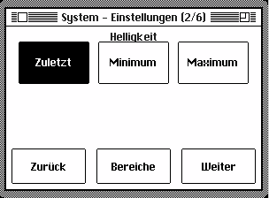 | 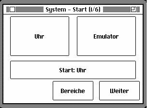 |

## 4. Sprache, Region, Datum und Uhrzeit

Unter **Allgemein > Sprache** English, Français, Español, Deutsch oder Italiano
wählen. **Allgemein > Regional** bestimmt Datumsreihenfolge, 12/24 Stunden und
Celsius/Fahrenheit.

| Sprache | Region |
| --- | --- |
| 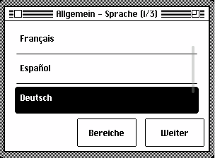 | 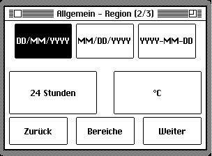 |

Unter **Allgemein > Datum / Uhrzeit** einen Wert auswählen und mit **-** oder
**+** ändern. Gedrückthalten wiederholt die Änderung.

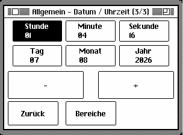

## 5. Zifferblätter und Anzeige

**Anzeige > Anzeige** steuert führende Null, Wochentag, Sekunden und helles
oder dunkles Design. Unter **Anzeige > Zifferblatt** stehen Macintosh, Kompakt,
Analog, Flip, Kilometerzähler und Mac OS 8 bereit.

| Macintosh | Kompakt | Analog |
| --- | --- | --- |
|  |  |  |

| Flip | Kilometerzähler | Mac OS 8 |
| --- | --- | --- |
|  |  |  |

Akzentfarbe, Zifferngröße, Wetteranzeige und Flip-Geschwindigkeit sind ebenfalls
einstellbar.

## 6. Bildschirmschoner

Unter **Anzeige > Bildschirmschoner** zeigt **Wiedergabe** eine Vorschau, ohne
die gespeicherte Wahl zu ändern. **Zufällig** wechselt Modi, **Aus** deaktiviert
den automatischen Start.

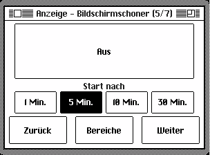

| After Dark | Sternenfeld | Springender Mac |
| --- | --- | --- |
|  |  |  |

| Matrix-Regen | Röhren | Fliegende Uhren |
| --- | --- | --- |
|  |  |  |

| Fliegende Toaster | Laufschrift | Digitale Regenuhr |
| --- | --- | --- |
|  |  |  |

| Mystify | Aquarium | Spiel des Lebens |
| --- | --- | --- |
|  |  |  |

| Labyrinth | Fehlerparade | Regenfenster |
| --- | --- | --- |
|  |  |  |

| Feuerwerk | Foto-Diashow |
| --- | --- |
|  | 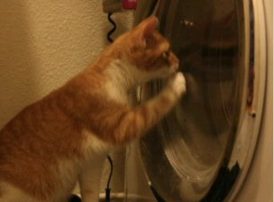 |

Fotos für die Diashow werden in der Bildschirmschoner-App des Web-Bedienfelds
hinzugefügt, angesehen und gelöscht.

## 7. Nachtmodus

Unter **Anzeige > Nacht** Zeitplan und Beginn/Ende einstellen sowie Dimmen oder
Ausschalten wählen. Uhr und Alarme bleiben aktiv. Touchscreen, oberer Sensor
oder eine Fronttaste wecken die Anzeige vorübergehend.

| Zeitplan | Verhalten |
| --- | --- |
| 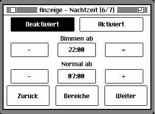 | 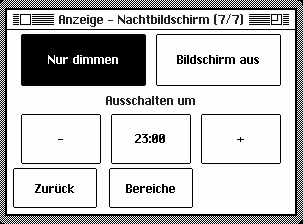 |

## 8. Alarme

**Alarm** drücken, **Alarm** und einen der drei Einträge wählen. Uhrzeit,
Wiederholung oder einmaligen Alarm, Bezeichnung, Klang und Lautstärke einstellen.
Ansteigende Lautstärke und Sonnenaufgangsanzeige sind optional. Mit
**Speichern** abschließen.

| Auswahl | Alarm | Uhrzeit |
| --- | --- | --- |
|  |  |  |

| Tage | Klang | Lautstärke |
| --- | --- | --- |
|  |  |  |

Ein einmaliger Alarm deaktiviert sich nach dem Klingeln. Für neun Minuten
Schlummern Alarm drücken, den oberen Sensor berühren oder **Schlummern** wählen.
Uhr oder **Beenden** stoppt ihn.

## 9. Timer

**Alarm > Timer** öffnen, Dauer mit **-10**, **-1**, **+1**, **+10** ändern und
**Start** wählen. Er läuft auf dem Zifferblatt weiter und ersetzt das Datum
durch die Restzeit. Am Ende beenden oder Uhr/Alarm drücken.

## 10. Stundenschlag

Unter **Ton** keinen, stündlichen oder viertelstündlichen Schlag sowie Klang,
Lautstärke und Ruhezeiten wählen.

| Häufigkeit | Klang | Lautstärke | Ruhezeit |
| --- | --- | --- | --- |
| 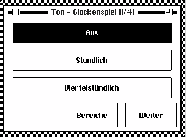 | 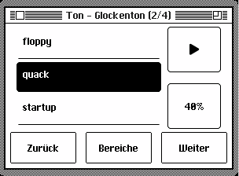 | 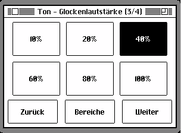 | 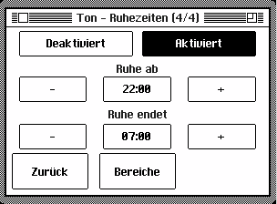 |

## 11. WLAN und Wetter

WLAN ist optional. **System > WLAN > WLAN einrichten** öffnen, QR-Code scannen,
Netzwerk und Kennwort sowie Stadt und Land eingeben. Danach kann Maclock Zeit
synchronisieren, Wetter anzeigen, Updates suchen und das Web-Bedienfeld öffnen.

| WLAN | Einrichtungs-QR-Code |
| --- | --- |
| 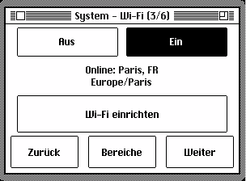 |  |

## 12. Web-Bedienfeld

Im selben Netzwerk die Adresse aus **System > Werkzeuge > Diagnose** öffnen.
Am Computer einmal zum Markieren und doppelt zum Öffnen klicken; auf Touchgeräten
einmal tippen. Fenster schließen oder außerhalb klicken, um zurückzukehren.

Das Bedienfeld verwaltet Darstellung, Standort, Bildschirmschoner, Timer,
Alarme, Nachtmodus, Glockenschlag, Klänge, Updates, Sicherungen und
Emulatordateien. Beim Schließen ungespeicherter Änderungen kann man weiter
bearbeiten oder verwerfen.

Im **Sound-Manager** MP3 ablegen/auswählen, von einer URL importieren, MyInstants
durchsuchen, vorhören und eigene Klänge löschen. Eingebaute Klänge bleiben.

**Konfigurationssicherung** exportiert und importiert Einstellungen. **MQTT**
ermöglicht optional die Verbindung mit kompatibler Hausautomation.

## 13. Softwareaktualisierungen

**System > Softwareaktualisierung** oder die entsprechende Web-App öffnen.

| Aktualisierungsseite | Neue Version |
| --- | --- |
| 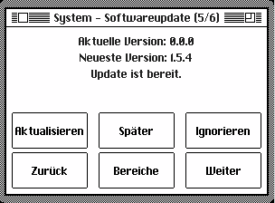 |  |

**Aktualisieren**, **Später** oder **Ignorieren** wählen. Strom und WLAN bis zum
Ende angeschlossen lassen. Nach einer Unterbrechung neu starten, damit Maclock
fortsetzt. Eigene Klänge und Emulatordateien bleiben erhalten; bei Platzmangel
nicht benötigte Klänge löschen.

## 14. Werkzeuge und Über

**System > Werkzeuge** enthält Diagnose und Wartung. Diagnose zeigt den Zustand
der Hauptfunktionen. **Über** zeigt Autor und Projekt-QR-Code.

| Werkzeuge | Diagnose | Über |
| --- | --- | --- |
| 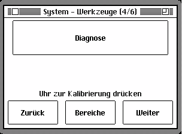 |  | 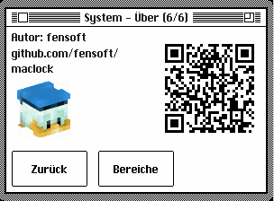 |

## 15. Macintosh-Emulator

Nur mit Touchscreen verfügbar. Ziehen bewegt den Zeiger, oberer Sensor klickt,
Uhr ist Eingabe und Alarm Escape. Der Drehregler ändert die Helligkeit.
**Uhr + Alarm** zwei Sekunden halten, um vor dem Ausschalten sicher zu beenden.

| Über diesen Macintosh | MacPaint |
| --- | --- |
|  |  |

**Mini-vMac-Dateien** im Web-Bedienfeld sichert, ersetzt oder ergänzt Dateien.
Wichtige Daten vorher sichern und nur rechtmäßig nutzbare Software verwenden.

## 16. Touchscreen-Kalibrierung

Wenn Berührungen nicht zu den Elementen passen, Konfiguration öffnen und Uhr
erneut drücken. Die vier Kreuze der Reihe nach berühren und loslassen. Uhr
bricht ohne Speichern ab.

