# Manual de usuario de Maclock

[English](manual.md) · [Français](manual.fr.md) · **Español** ·
[Deutsch](manual.de.md) · [Italiano](manual.it.md)

Este manual explica cómo utilizar Maclock. Para el montaje y la instalación,
consulta la [guía de construcción](BUILD.md).

## 1. Conoce tu Maclock

Maclock tiene pantalla táctil, control giratorio, dos botones frontales, sensor
táctil superior y palanca de disquete.

| Control | Reloj | Emulador Macintosh |
| --- | --- | --- |
| Control giratorio | Brillo o navegación sin pantalla táctil | Brillo |
| Botón Reloj | Configuración, descartar alarma, despertar pantalla | Intro |
| Botón Alarma | Alarmas y temporizador, posponer, despertar pantalla | Escape |
| Reloj + Alarma | Configuración | Salir de forma segura |
| Pantalla táctil | Menús y puntero | Mover el puntero |
| Sensor superior | Brillo máximo temporal o posponer | Clic del ratón |

Sin pantalla táctil, gira el control para mover la selección parpadeante y
toca el sensor superior para activarla. En el reloj y los salvapantallas sigue
controlando el brillo. La calibración y el emulador no estarán disponibles
hasta reconectar la pantalla y reiniciar Maclock.

## 2. Primeros pasos

Conecta Maclock, inserta el disquete cuando aparezcan los símbolos alternos y
espera a que termine el arranque. Se mostrará la esfera elegida.

| Configuración | Reloj Macintosh |
| --- | --- |
| 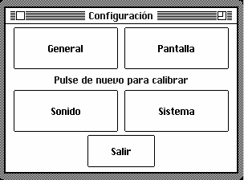 |  |

Si un aviso vuelve a aparecer tras reiniciar, consulta
[Solución de problemas](TROUBLESHOOTING.md).

## 3. Configuración

Pulsa **Reloj** desde la esfera normal, o mantenlo pulsado al conectar la
alimentación. Las cuatro secciones son:

- **General** — idioma, región, fecha y hora.
- **Pantalla** — esferas, apariencia, salvapantallas y modo nocturno.
- **Sonido** — campanadas, sonidos, volumen y horas de silencio.
- **Sistema** — inicio, Wi-Fi, actualizaciones, herramientas y Acerca de.

Usa **Secciones** para volver al selector y **Salir** para regresar al reloj.
En **Sistema > Inicio**, abre Reloj o Emulador ahora y elige cuál se iniciará la
próxima vez. También puedes conservar el último brillo, usar el mínimo visible
o el máximo.

| Brillo inicial | Modo de inicio |
| --- | --- |
| 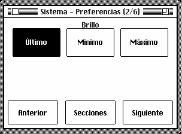 | 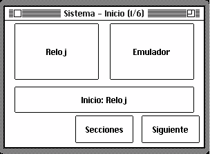 |

## 4. Idioma, región, fecha y hora

En **General > Idioma**, elige English, Français, Español, Deutsch o Italiano.
En **General > Regional**, configura el orden de la fecha, 12/24 horas y
Celsius/Fahrenheit.

| Idioma | Opciones regionales |
| --- | --- |
| 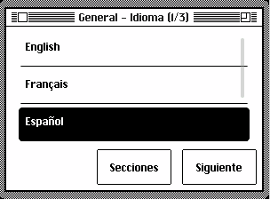 | 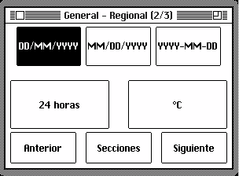 |

Para cambiar la fecha u hora, abre **General > Fecha / Hora**, selecciona una
parte y usa **-** o **+**. Mantén pulsado para repetir.

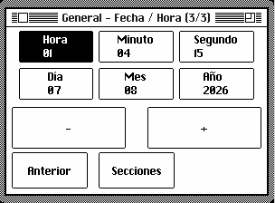

## 5. Esferas y pantalla

En **Pantalla > Pantalla**, elige cero inicial, día de la semana, segundos y
apariencia clara u oscura. En **Pantalla > Esfera**, elige Macintosh, Compacta,
Analógica, Flip, Odómetro o Mac OS 8.

| Macintosh | Compacta | Analógica |
| --- | --- | --- |
|  |  |  |

| Flip | Odómetro | Mac OS 8 |
| --- | --- | --- |
|  |  |  |

También puedes ajustar el color de acento, tamaño de números, información
meteorológica y velocidad de la animación Flip.

## 6. Salvapantallas

Abre **Pantalla > Salvapantallas**. **Reproducir** muestra una vista previa sin
cambiar la opción guardada; **Aleatorio** alterna los modos y **Desactivado**
impide el inicio automático.

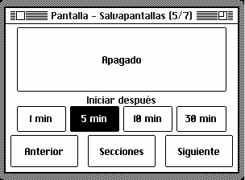

| After Dark | Campo de estrellas | Mac rebotando |
| --- | --- | --- |
|  |  |  |

| Lluvia Matrix | Tuberías | Relojes voladores |
| --- | --- | --- |
|  |  |  |

| Tostadoras voladoras | Marquesina | Reloj de lluvia digital |
| --- | --- | --- |
|  |  |  |

| Mystify | Acuario | Juego de la vida |
| --- | --- | --- |
|  |  |  |

| Laberinto | Desfile de errores | Ventana lluviosa |
| --- | --- | --- |
|  |  |  |

| Fuegos artificiales | Presentación de fotos |
| --- | --- |
|  |  |

La aplicación Salvapantallas del panel web permite añadir, ver y borrar las
fotos de la presentación.

## 7. Modo nocturno

En **Pantalla > Noche**, activa el horario, elige inicio y fin y decide entre
atenuar o apagar la pantalla. El reloj y las alarmas siguen activos. Toca la
pantalla o el sensor, o pulsa un botón frontal, para despertarla temporalmente.

| Horario | Comportamiento |
| --- | --- |
| 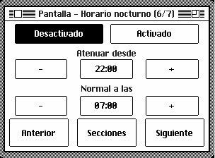 | 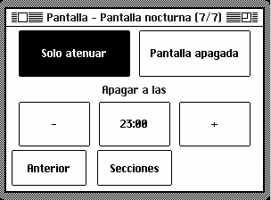 |

## 8. Alarmas

Pulsa **Alarma**, elige **Alarma** y una de las tres alarmas. Ajusta hora,
repetición semanal o única, etiqueta, sonido y volumen. El volumen gradual y
la pantalla de amanecer son opcionales. Pulsa **Guardar**.

| Inicio | Selección | Hora |
| --- | --- | --- |
|  |  |  |

| Días | Sonido | Volumen |
| --- | --- | --- |
|  |  |  |

Una alarma única se desactiva después de sonar. Para posponer nueve minutos,
pulsa Alarma, toca el sensor superior o elige **Posponer**. Para detenerla,
pulsa Reloj o elige **Descartar**.

## 9. Temporizador

Pulsa **Alarma > Temporizador**, ajusta con **-10**, **-1**, **+1** y **+10** y
pulsa **Iniciar**. Continúa mientras se muestra el reloj y sustituye la fecha
por el tiempo restante. Al finalizar, descártalo o pulsa Reloj o Alarma.

## 10. Campanada horaria

En **Sonido**, selecciona ninguna campanada, cada hora o cada cuarto de hora,
además del sonido, volumen y horas de silencio.

| Frecuencia | Sonido | Volumen | Silencio |
| --- | --- | --- | --- |
| 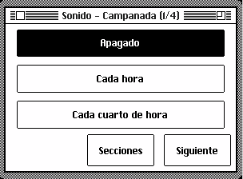 | 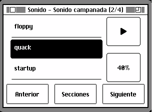 | 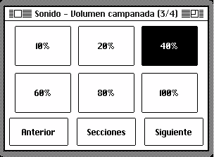 | 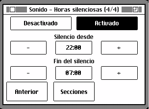 |

## 11. Wi-Fi y tiempo

El Wi-Fi es opcional. Abre **Sistema > Wi-Fi > Configurar Wi-Fi**, escanea el
QR, selecciona tu red, introduce la contraseña y después ciudad y país. Maclock
podrá sincronizar la hora, mostrar el tiempo, buscar actualizaciones y ofrecer
el panel web.

| Wi-Fi | QR de configuración |
| --- | --- |
| 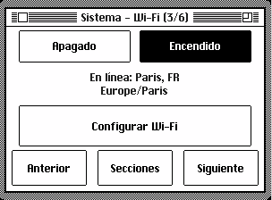 |  |

## 12. Panel de control web

Desde la misma red, abre la dirección de **Sistema > Herramientas >
Diagnóstico**. En ordenador, un clic selecciona y dos abren; en pantalla táctil,
un toque abre. Cierra la ventana o pulsa fuera para volver al lanzador.

El panel controla apariencia, ubicación, salvapantallas, temporizadores,
alarmas, noche, campanadas, sonidos, actualizaciones, copias de seguridad y
archivos del emulador. Si cierras cambios no guardados, puedes seguir editando
o descartarlos.

**Gestor de sonidos** permite soltar o elegir un MP3, importar una URL, buscar
en MyInstants, previsualizar y borrar sonidos añadidos. Los sonidos integrados
no se pueden borrar.

**Copia de configuración** exporta y restaura ajustes. **MQTT** ofrece una
integración opcional con sistemas domóticos compatibles.

## 13. Actualizaciones

Abre **Sistema > Actualización de software** o la aplicación web equivalente.

| Página de actualización | Nueva versión |
| --- | --- |
| 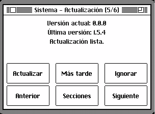 |  |

Elige **Actualizar**, **Más tarde** o **Ignorar**. Mantén Maclock conectado a
la corriente y al Wi-Fi. Tras una interrupción, reinícialo para que continúe.
Los sonidos y archivos del emulador se conservan; si falta espacio, elimina
sonidos que no necesites.

## 14. Herramientas y Acerca de

**Sistema > Herramientas** contiene diagnóstico y mantenimiento. Diagnóstico
muestra el estado de las funciones principales. **Acerca de** muestra el autor
y un QR del proyecto.

| Herramientas | Diagnóstico | Acerca de |
| --- | --- | --- |
| 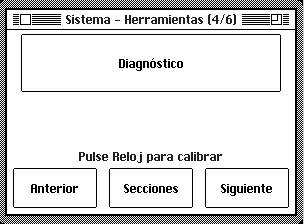 |  | 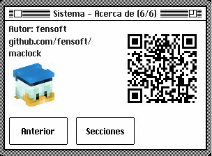 |

## 15. Emulador Macintosh

Solo está disponible con pantalla táctil. Arrastra para mover el puntero, toca
el sensor superior para hacer clic, usa Reloj como Intro y Alarma como Escape.
La rueda ajusta el brillo. Mantén **Reloj + Alarma** dos segundos para salir de
forma segura antes de desconectar la alimentación.

| Acerca de este Macintosh | MacPaint |
| --- | --- |
|  |  |

**Archivos Mini vMac** en el panel web permite copiar, sustituir o añadir
archivos. Haz copias de lo importante y usa solo software que puedas utilizar
legalmente.

## 16. Calibración táctil

Si los toques no coinciden con los controles, abre Configuración y pulsa Reloj
otra vez. Toca y suelta las cuatro cruces en orden. Reloj cancela el proceso
sin guardar.

