# Manuel d’utilisation de Maclock

[English](manual.md) · **Français** · [Español](manual.es.md) ·
[Deutsch](manual.de.md) · [Italiano](manual.it.md)

Ce manuel explique l’utilisation de Maclock. Pour l’assemblage et
l’installation, consultez le [guide de construction](BUILD.md).

## 1. Découvrir Maclock

Maclock possède un écran tactile, une molette, deux boutons en façade, un
capteur tactile supérieur et un levier de disquette.

| Commande | Horloge | Émulateur Macintosh |
| --- | --- | --- |
| Molette | Luminosité, ou navigation sans écran tactile | Luminosité |
| Horloge | Configuration, arrêter une alarme, réveiller l’écran | Entrée |
| Alarme | Alarmes et minuteur, répétition, réveiller l’écran | Échap |
| Horloge + Alarme | Configuration | Quitter proprement l’émulateur |
| Écran tactile | Menus et pointeur | Déplacer le pointeur |
| Capteur supérieur | Luminosité maximale temporaire ou répétition | Clic souris |

### Sans écran tactile

Tournez la molette pour déplacer la sélection clignotante et touchez le
capteur supérieur pour valider. Sur l’horloge et les économiseurs, la molette
règle toujours la luminosité. L’étalonnage et l’émulateur restent indisponibles
jusqu’au rebranchement de l’écran tactile et au redémarrage.

## 2. Premier démarrage

1. Branchez Maclock.
2. Insérez la disquette lorsque les symboles alternés apparaissent.
3. Attendez la fin du démarrage.
4. Le cadran choisi s’affiche.

| Configuration | Horloge Macintosh |
| --- | --- |
| 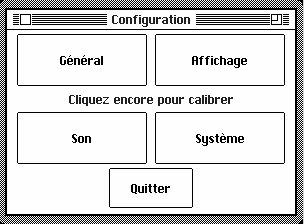 |  |

Si un avertissement réapparaît après un redémarrage, consultez le
[dépannage](TROUBLESHOOTING.md).

## 3. Configuration

Depuis l’horloge, appuyez sur **Horloge**. Vous pouvez aussi maintenir ce
bouton pendant la mise sous tension. Les quatre rubriques sont :

- **Général** — langue, région, date et heure.
- **Affichage** — cadrans, apparence, économiseurs et mode nuit.
- **Son** — carillon, sons, volume et heures silencieuses.
- **Système** — démarrage, Wi-Fi, mises à jour, outils et À propos.

Utilisez **Sections** pour revenir au choix des rubriques et **Quitter** pour
revenir à l’horloge.

### Choisir le mode de démarrage

Ouvrez **Système > Démarrage**. Les grands boutons ouvrent immédiatement
l’horloge ou l’émulateur. **Démarrage : Horloge/Émulateur** choisit le mode du
prochain allumage. Vous pouvez aussi conserver la dernière luminosité, choisir
le minimum visible ou le maximum.

| Luminosité au démarrage | Mode de démarrage |
| --- | --- |
| 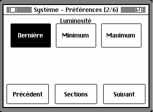 | 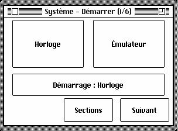 |

## 4. Langue, région, date et heure

Dans **Général > Langue**, choisissez English, Français, Español, Deutsch ou
Italiano. Dans **Général > Région**, choisissez l’ordre jour/mois/année, le
format 12/24 heures et Celsius/Fahrenheit.

| Langue | Réglages régionaux |
| --- | --- |
| 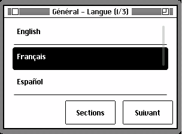 | 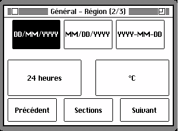 |

Pour régler l’horloge, ouvrez **Général > Date / Heure**, sélectionnez une
valeur puis utilisez **-** et **+**. Un appui prolongé répète l’action.

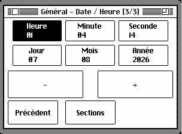

## 5. Cadrans et affichage

Dans **Affichage > Affichage**, activez selon vos préférences le zéro initial,
le jour de la semaine, les secondes et le thème clair ou sombre.

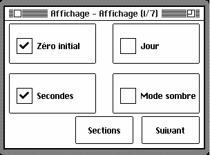

Dans **Affichage > Cadran**, choisissez Macintosh, Compact, Analogique, Flip,
Compteur ou Mac OS 8.

| Macintosh | Compact | Analogique |
| --- | --- | --- |
|  |  |  |

| Flip | Compteur | Mac OS 8 |
| --- | --- | --- |
|  |  |  |

La couleur d’accent, la taille des chiffres, la météo et la vitesse de
l’animation Flip sont également réglables.

## 6. Économiseurs d’écran

Ouvrez **Affichage > Économiseur**. Le bouton **Lecture** prévisualise un choix
sans modifier celui qui est enregistré. **Aléatoire** alterne les modes et
**Désactivé** coupe le lancement automatique.

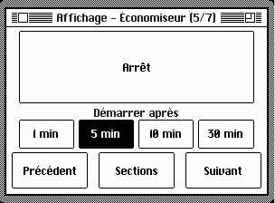

| After Dark | Champ d’étoiles | Mac rebondissant |
| --- | --- | --- |
|  |  |  |

| Pluie Matrix | Tuyaux | Horloges volantes |
| --- | --- | --- |
|  |  |  |

| Grille-pain volants | Bandeau | Horloge pluie numérique |
| --- | --- | --- |
|  |  |  |

| Mystify | Aquarium | Jeu de la vie |
| --- | --- | --- |
|  |  |  |

| Labyrinthe | Parade d’erreurs | Fenêtre pluvieuse |
| --- | --- | --- |
|  |  |  |

| Feux d’artifice | Diaporama photo |
| --- | --- |
|  |  |

L’application Économiseur du panneau web permet d’ajouter, voir et supprimer
les photos du diaporama.

## 7. Mode nuit

Dans **Affichage > Nuit**, activez la programmation, choisissez ses heures et
décidez de réduire la luminosité ou d’éteindre l’écran. L’horloge et les
alarmes restent actives. Touchez l’écran ou le capteur, ou appuyez sur un
bouton frontal, pour réveiller temporairement l’affichage.

| Horaire | Comportement |
| --- | --- |
| 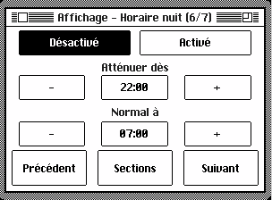 | 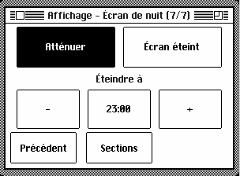 |

## 8. Alarmes

Appuyez sur **Alarme**, choisissez **Alarme** puis l’une des trois alarmes.
Réglez l’heure, la répétition hebdomadaire ou unique, le libellé, le son et le
volume. Le volume progressif et l’écran lever de soleil sont facultatifs.
Terminez avec **Enregistrer**.

| Choix | Alarme | Heure |
| --- | --- | --- |
|  |  |  |

| Jours | Son | Volume |
| --- | --- | --- |
|  |  |  |

La prochaine alarme est affichée. Une alarme unique se désactive après avoir
sonné. Pour répéter, appuyez sur **Alarme**, touchez le capteur supérieur ou
choisissez **Répéter 9 min**. Pour arrêter, appuyez sur **Horloge** ou
choisissez **Arrêter**.

## 9. Minuteur

Appuyez sur **Alarme > Minuteur**, réglez la durée avec **-10**, **-1**, **+1**
et **+10**, puis choisissez **Démarrer**. Il continue sur le cadran et remplace
la date par le temps restant. À la fin, choisissez **Arrêter** ou appuyez sur
Horloge ou Alarme.

## 10. Carillon horaire

Dans **Son**, choisissez aucun carillon, toutes les heures ou tous les quarts
d’heure, puis le son, le volume et les heures silencieuses.

| Fréquence | Son | Volume | Silence |
| --- | --- | --- | --- |
| 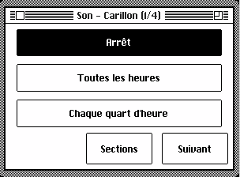 | 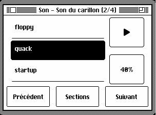 | 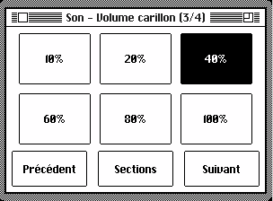 | 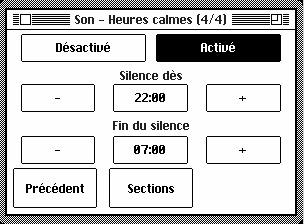 |

## 11. Wi-Fi et météo

Le Wi-Fi reste facultatif. Ouvrez **Système > Wi-Fi > Configurer le Wi-Fi**,
scannez le QR code, choisissez votre réseau, saisissez son mot de passe puis
votre ville et pays. Une fois connecté, Maclock règle l’heure, affiche la
météo, recherche les mises à jour et propose son panneau web.

| Wi-Fi | QR de configuration |
| --- | --- |
| 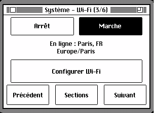 |  |

## 12. Panneau de contrôle web

Depuis un appareil du même réseau, ouvrez l’adresse indiquée dans
**Système > Outils > Diagnostic**. Sur ordinateur, cliquez une fois pour
sélectionner et deux fois pour ouvrir ; sur écran tactile, touchez une fois.
Fermez la fenêtre ou cliquez à l’extérieur pour revenir au lanceur.

Le panneau gère l’apparence, le lieu, les économiseurs, minuteurs, alarmes,
mode nuit, carillons, sons, mises à jour, sauvegardes et fichiers émulateur.
Une fermeture avec des modifications non enregistrées propose de continuer ou
de les abandonner.

Dans **Gestionnaire de sons**, déposez ou choisissez un MP3, importez une URL,
recherchez MyInstants, écoutez et supprimez vos sons. Les sons intégrés ne sont
pas supprimables.

**Sauvegarde de configuration** exporte et restaure vos réglages. L’application
**MQTT** permet l’intégration facultative à une installation domotique.

## 13. Mises à jour

Maclock vérifie les nouvelles versions en ligne. Ouvrez
**Système > Mise à jour logicielle** ou l’application web correspondante.

| Page de mise à jour | Nouvelle version |
| --- | --- |
| 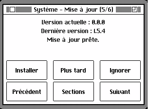 |  |

Choisissez **Mettre à jour**, **Plus tard** ou **Ignorer**. Gardez Maclock
alimenté et connecté au Wi-Fi jusqu’à la fin. Après une interruption,
redémarrez-le et laissez-le reprendre. Vos sons et fichiers émulateur sont
conservés. En cas de manque d’espace, supprimez des sons inutiles.

## 14. Outils et À propos

**Système > Outils** donne accès au diagnostic et à la maintenance. Le
diagnostic indique la disponibilité des fonctions principales. **À propos**
affiche l’auteur et un QR code vers le projet.

| Outils | Diagnostic | À propos |
| --- | --- | --- |
| 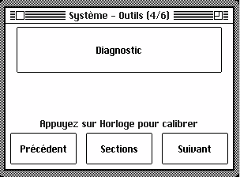 |  | 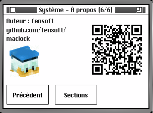 |

## 15. Émulateur Macintosh

L’émulateur est disponible uniquement avec l’écran tactile. Glissez pour
déplacer le pointeur, touchez le capteur supérieur pour cliquer, utilisez
Horloge comme Entrée et Alarme comme Échap. La molette règle la luminosité.
Maintenez **Horloge + Alarme** deux secondes pour quitter proprement avant de
couper l’alimentation.

| À propos de ce Macintosh | MacPaint |
| --- | --- |
|  |  |

Dans le panneau web, **Fichiers Mini vMac** permet de sauvegarder, remplacer ou
ajouter des fichiers. Sauvegardez les données importantes et utilisez
uniquement les logiciels auxquels vous avez légalement droit.

## 16. Étalonnage tactile

Si les touchers ne correspondent plus aux commandes, ouvrez Configuration et
appuyez de nouveau sur Horloge. Touchez puis relâchez les quatre croix dans
l’ordre. Maclock enregistre ensuite le réglage. Appuyez sur Horloge pendant
l’étalonnage pour annuler.

