# Manuale utente di Maclock

[English](manual.md) · [Français](manual.fr.md) · [Español](manual.es.md) ·
[Deutsch](manual.de.md) · **Italiano**

Questo manuale spiega come usare Maclock. Per montaggio e installazione,
consulta la [guida alla costruzione](BUILD.md).

## 1. Conoscere Maclock

Maclock dispone di touchscreen, manopola, due pulsanti frontali, sensore touch
superiore e leva del floppy.

| Comando | Orologio | Emulatore Macintosh |
| --- | --- | --- |
| Manopola | Luminosità o navigazione senza touchscreen | Luminosità |
| Orologio | Configurazione, chiude allarme, riattiva schermo | Invio |
| Allarme | Allarmi e timer, snooze, riattiva schermo | Esc |
| Orologio + Allarme | Configurazione | Uscita sicura dall’emulatore |
| Touchscreen | Menu e puntatore | Muove il puntatore |
| Sensore superiore | Luminosità massima temporanea o snooze | Clic mouse |

Senza touchscreen, ruota la manopola per spostare la selezione lampeggiante e
tocca il sensore superiore per attivarla. Su orologio e salvaschermo regola la
luminosità. Calibrazione ed emulatore restano disabilitati finché il touchscreen
non viene ricollegato e Maclock riavviato.

## 2. Primo avvio

Collega Maclock, inserisci il floppy quando compaiono i simboli alternati e
attendi l’avvio. Comparirà il quadrante scelto.

| Configurazione | Orologio Macintosh |
| --- | --- |
| 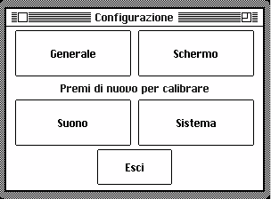 |  |

Se un avviso ricompare dopo il riavvio, consulta la
[risoluzione dei problemi](TROUBLESHOOTING.md).

## 3. Configurazione

Dall’orologio premi **Orologio**, oppure tienilo premuto durante l’accensione.

- **Generale** — lingua, regione, data e ora.
- **Display** — quadranti, aspetto, salvaschermo e modalità notte.
- **Suono** — rintocchi, suoni, volume e ore silenziose.
- **Sistema** — avvio, Wi-Fi, aggiornamenti, strumenti e Informazioni.

**Sezioni** torna alla scelta delle sezioni; **Esci** torna all’orologio. In
**Sistema > Avvio** puoi aprire subito Orologio o Emulatore e scegliere il modo
del prossimo avvio. Puoi anche mantenere l’ultima luminosità, usare la minima
visibile o la massima.

| Luminosità iniziale | Modalità di avvio |
| --- | --- |
| 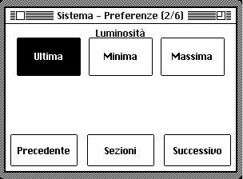 | 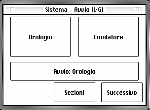 |

## 4. Lingua, regione, data e ora

In **Generale > Lingua** scegli English, Français, Español, Deutsch o Italiano.
**Generale > Regionale** imposta ordine della data, formato 12/24 ore e
Celsius/Fahrenheit.

| Lingua | Opzioni regionali |
| --- | --- |
| 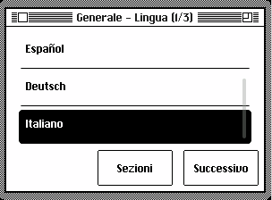 | 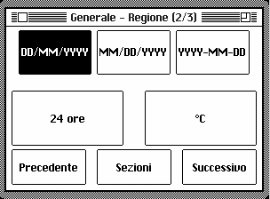 |

Per cambiare data e ora, apri **Generale > Data / Ora**, seleziona una parte e
usa **-** o **+**. Tieni premuto per ripetere.

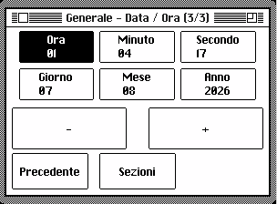

## 5. Quadranti e display

In **Display > Display** scegli zero iniziale, giorno della settimana, secondi
e tema chiaro o scuro. In **Display > Quadrante** scegli Macintosh, Compatto,
Analogico, Flip, Contachilometri o Mac OS 8.

| Macintosh | Compatto | Analogico |
| --- | --- | --- |
|  |  |  |

| Flip | Contachilometri | Mac OS 8 |
| --- | --- | --- |
|  |  |  |

Sono regolabili anche colore d’accento, dimensione dei numeri, meteo e velocità
dell’animazione Flip.

## 6. Salvaschermo

Apri **Display > Salvaschermo**. **Riproduci** mostra un’anteprima senza cambiare
la scelta salvata; **Casuale** alterna i modi e **Disattivato** impedisce
l’avvio automatico.

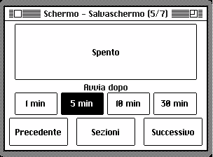

| After Dark | Campo stellare | Mac rimbalzante |
| --- | --- | --- |
|  |  |  |

| Pioggia Matrix | Tubi | Orologi volanti |
| --- | --- | --- |
|  |  |  |

| Tostapane volanti | Testo scorrevole | Orologio pioggia digitale |
| --- | --- | --- |
|  |  |  |

| Mystify | Acquario | Gioco della vita |
| --- | --- | --- |
|  |  |  |

| Labirinto | Parata errori | Finestra piovosa |
| --- | --- | --- |
|  |  |  |

| Fuochi d’artificio | Presentazione foto |
| --- | --- |
|  |  |

L’app Salvaschermo del pannello web consente di aggiungere, vedere ed eliminare
le fotografie della presentazione.

## 7. Modalità notte

In **Display > Notte**, abilita la pianificazione, scegli inizio e fine e decidi
se attenuare o spegnere lo schermo. Orologio e allarmi restano attivi. Tocca lo
schermo o il sensore, oppure premi un tasto frontale, per riattivarlo.

| Pianificazione | Comportamento |
| --- | --- |
| 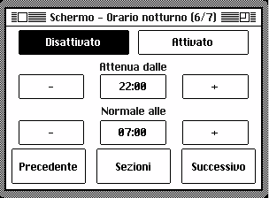 | 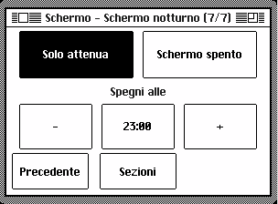 |

## 8. Allarmi

Premi **Allarme**, scegli **Allarme** e uno dei tre elementi. Imposta ora,
ripetizione settimanale o singola, etichetta, suono e volume. Volume graduale e
schermata alba sono facoltativi. Premi **Salva**.

| Scelta | Allarme | Ora |
| --- | --- | --- |
|  |  |  |

| Giorni | Suono | Volume |
| --- | --- | --- |
|  |  |  |

Un allarme singolo si disattiva dopo aver suonato. Per posticipare di nove
minuti premi Allarme, tocca il sensore superiore o scegli **Snooze**. Per
fermarlo premi Orologio o scegli **Chiudi**.

## 9. Timer

Apri **Allarme > Timer**, regola con **-10**, **-1**, **+1**, **+10** e premi
**Avvia**. Continua sul quadrante e sostituisce la data con il tempo restante.
Al termine chiudilo o premi Orologio o Allarme.

## 10. Rintocco orario

In **Suono**, scegli nessun rintocco, ogni ora o ogni quarto d’ora, quindi
suono, volume e ore silenziose.

| Frequenza | Suono | Volume | Silenzio |
| --- | --- | --- | --- |
| 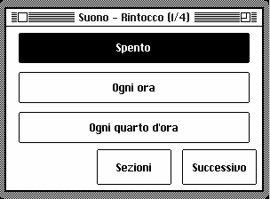 | 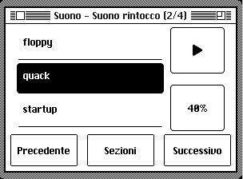 | 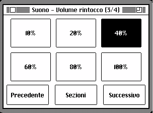 | 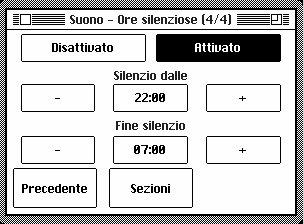 |

## 11. Wi-Fi e meteo

Il Wi-Fi è facoltativo. Apri **Sistema > Wi-Fi > Configura Wi-Fi**, scansiona
il QR, scegli la rete, inserisci password, città e paese. Maclock potrà
sincronizzare l’ora, mostrare il meteo, cercare aggiornamenti e fornire il
pannello web.

| Wi-Fi | QR di configurazione |
| --- | --- |
| 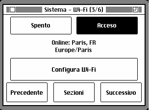 |  |

## 12. Pannello di controllo web

Dalla stessa rete apri l’indirizzo in **Sistema > Strumenti > Diagnostica**.
Sul computer un clic seleziona e due aprono; su touchscreen basta un tocco.
Chiudi la finestra o fai clic all’esterno per tornare al launcher.

Il pannello gestisce aspetto, posizione, salvaschermo, timer, allarmi, notte,
rintocchi, suoni, aggiornamenti, backup e file dell’emulatore. Chiudendo
modifiche non salvate puoi continuare o annullarle.

**Gestione suoni** permette di trascinare o scegliere un MP3, importare un URL,
cercare MyInstants, ascoltare ed eliminare suoni aggiunti. Quelli integrati non
possono essere rimossi.

**Backup configurazione** esporta e ripristina le impostazioni. **MQTT** offre
un collegamento facoltativo alla domotica compatibile.

## 13. Aggiornamenti software

Apri **Sistema > Aggiornamento software** o l’app web corrispondente.

| Pagina aggiornamento | Nuova versione |
| --- | --- |
| 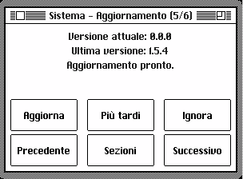 |  |

Scegli **Aggiorna**, **Più tardi** o **Ignora**. Mantieni alimentazione e Wi-Fi
fino al termine. Dopo un’interruzione riavvia Maclock per continuare. Suoni e
file dell’emulatore restano; se manca spazio elimina i suoni inutili.

## 14. Strumenti e Informazioni

**Sistema > Strumenti** contiene diagnostica e manutenzione. Diagnostica mostra
lo stato delle funzioni principali. **Informazioni** mostra autore e QR del
progetto.

| Strumenti | Diagnostica | Informazioni |
| --- | --- | --- |
| 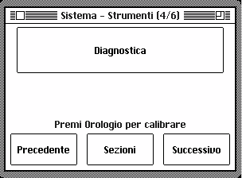 |  | 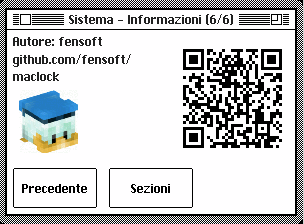 |

## 15. Emulatore Macintosh

È disponibile solo con touchscreen. Trascina per muovere il puntatore, tocca il
sensore superiore per fare clic, usa Orologio come Invio e Allarme come Esc. La
manopola regola la luminosità. Tieni **Orologio + Allarme** per due secondi per
uscire in sicurezza prima di scollegare l’alimentazione.

| Informazioni su questo Macintosh | MacPaint |
| --- | --- |
|  |  |

**File Mini vMac** nel pannello web consente backup, sostituzione e aggiunta di
file. Salva prima i dati importanti e usa solo software che puoi utilizzare
legalmente.

## 16. Calibrazione touchscreen

Se i tocchi non corrispondono ai comandi, apri Configurazione e premi di nuovo
Orologio. Tocca e rilascia le quattro croci in ordine. Orologio annulla senza
salvare.

