# Maclock User Manual

This manual explains how to use Maclock. For assembly and installation, see
the [Build Your Own guide](BUILD.md).

## 1. Meet Your Maclock

Maclock has a touchscreen, a rotary control, two front buttons, a top touch
sensor, and a floppy lever.

| Control | Clock | Macintosh emulator |
| --- | --- | --- |
| Rotary control | Change brightness, or move through menus when the touchscreen is unavailable | Change brightness |
| Clock button | Open Configuration, dismiss an alarm, or wake the screen | Enter |
| Alarm button | Open Alarms and Timer, snooze an alarm, or wake the screen | Escape |
| Clock + Alarm | Open Configuration | Leave the emulator safely |
| Touchscreen | Use menus and move the pointer | Move the pointer |
| Top touch sensor | Temporarily use full brightness or snooze an alarm | Press the mouse button |

### Using Maclock without a touchscreen

Maclock can still operate as a clock when its touchscreen is unavailable.

- Turn the rotary control to move the blinking selection through a menu.
- Touch the top sensor to activate the selected item.
- On the clock and screensavers, the rotary control changes brightness.
- The Clock and Alarm buttons keep their usual shortcuts.
- Calibration and the Macintosh emulator remain unavailable until the
  touchscreen is reconnected and Maclock is restarted.

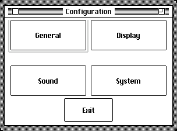

## 2. Getting Started

1. Connect Maclock to power.
2. Insert the floppy when the alternating floppy symbols appear.
3. Wait while Maclock starts.
4. The selected clock face appears.

| Configuration | Macintosh clock |
| --- | --- |
| 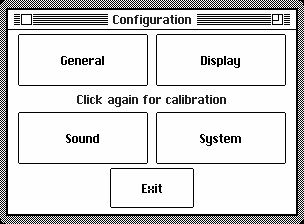 | 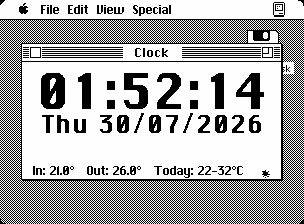 |

If Maclock shows a warning during startup, restart it once. If the warning
returns, see [Troubleshooting](TROUBLESHOOTING.md).

## 3. Configuration

Press **Clock** from the normal clock to open Configuration. You can also hold
Clock while connecting power.

Configuration is divided into four sections:

- **General** — language, regional choices, date, and time.
- **Display** — clock faces, appearance, screensavers, and night mode.
- **Sound** — hourly chimes, sounds, volume, and quiet hours.
- **System** — startup choice, Wi-Fi, updates, tools, and About.

Use **Sections** to return to the section chooser. Use **Exit** to return to
the clock.

### Choose what starts

1. Open **System**, then **Start**.
2. Select the large **Clock** or **Emulator** button to open it now.
3. Select **Boot: Clock** or **Boot: Emulator** to choose what Maclock opens
   automatically next time.

| Brightness at startup | Startup choice |
| --- | --- |
| 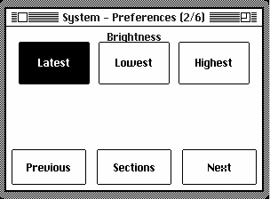 | 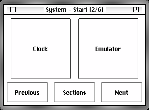 |

You can also choose whether Maclock starts at the previous brightness, its
lowest visible brightness, or full brightness.

## 4. Language, Region, Date, and Time

### Language

Open **General > Language**, then choose English, Français, Español, Deutsch,
or Italiano. Maclock remembers your choice.

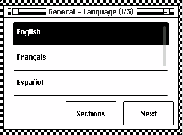

### Regional choices

Open **General > Regional** to choose:

- The order of day, month, and year.
- 12-hour or 24-hour time.
- Celsius or Fahrenheit.

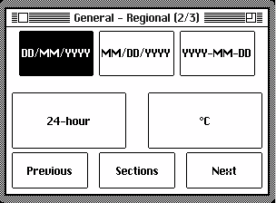

### Set the date and time

1. Open **General > Date / Time**.
2. Select the part you want to change.
3. Use **-** and **+**. Hold either button to repeat.

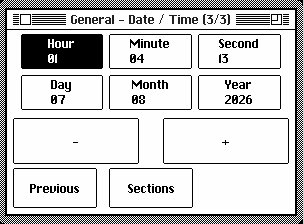

## 5. Clock Faces and Display

### Display options

Open **Display > Display** to choose whether to show:

- An initial zero before single-digit hours.
- The weekday.
- Seconds.
- A light or dark appearance.

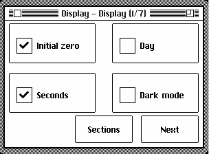

### Clock faces

Open **Display > Clock Face** and choose the face you prefer.

| Macintosh | Compact |
| --- | --- |
|  | 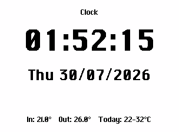 |

| Analog | Flip |
| --- | --- |
| 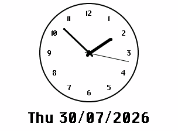 | 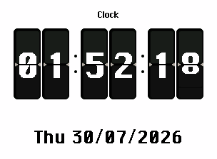 |

| Odometer | Mac OS 8 |
| --- | --- |
| 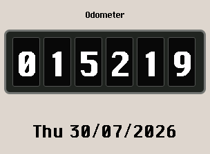 | 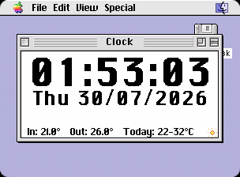 |

You can also choose an accent color, numeral size, weather display, and Flip
animation speed.

| Clock face | Style | Details |
| --- | --- | --- |
| 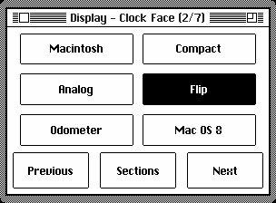 | 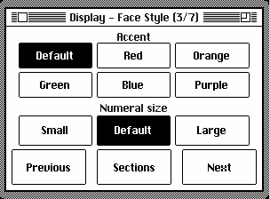 | 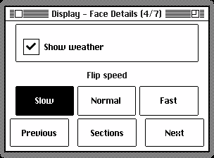 |

## 6. Screensavers

Open **Display > Screensaver** to choose what appears after Maclock has not
been used for a while.

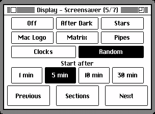

| After Dark | Starfield |
| --- | --- |
|  |  |

| Bouncing Mac | Matrix Rain |
| --- | --- |
| 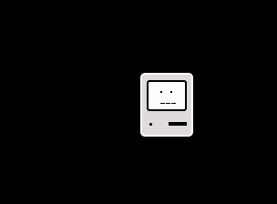 |  |

| Pipes | Flying Clocks |
| --- | --- |
|  | 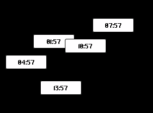 |

| Flying Toasters | Marquee |
| --- | --- |
|  | 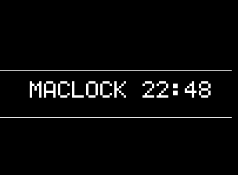 |

| Digital Rain Clock | Mystify |
| --- | --- |
| 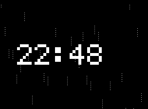 |  |

| Aquarium | Life |
| --- | --- |
|  |  |

| Maze | Error Parade |
| --- | --- |
|  | 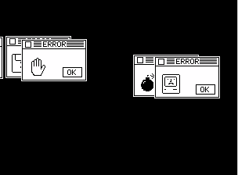 |

| Rainy Window | Fireworks |
| --- | --- |
| 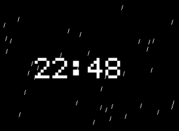 |  |

| Photo Slideshow |
| --- |

- Select **Play** beside a choice to preview it without changing your saved
  screensaver.
- Select **Random** to rotate between available screensavers.
- Select **Off** to disable automatic screensavers.
- Use the Screensaver application in the web control panel to add, view, and
  remove slideshow photographs.

## 7. Night Mode

Night mode can lower the brightness automatically and optionally turn off the
screen while keeping the clock and alarms active.

1. Open **Display > Night**.
2. Enable the schedule and choose its beginning and end.
3. Choose whether to dim the display or turn it off.

| Night schedule | Night behavior |
| --- | --- |
| 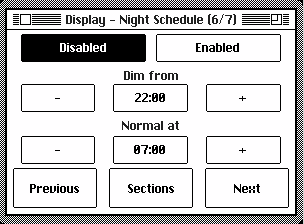 | 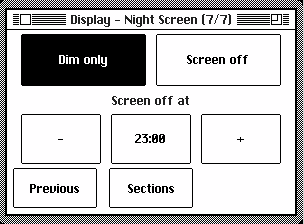 |

Touch the screen or top sensor, or press either front button, to wake the
display temporarily. Alarms and completed timers wake it automatically.

## 8. Alarms

### Set an alarm

1. Press **Alarm** on the clock.
2. Select **Alarm**, then choose one of the three alarms.
3. Set the hour and minute.
4. Choose a repeating schedule or a one-time alarm.
5. Optionally add a label.
6. Choose a sound and volume.
7. Optionally enable gradual volume and the sunrise display.
8. Select **Save**.

| Alarm or Timer | Select alarm | Set time |
| --- | --- | --- |
| 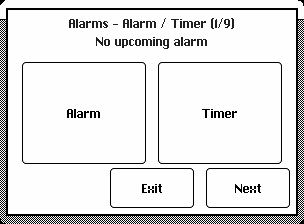 | 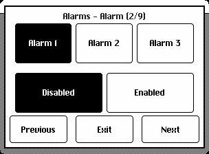 | 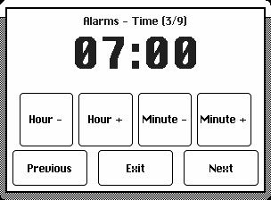 |

| Repeat days | Sound | Volume |
| --- | --- | --- |
| 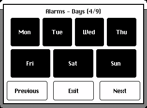 | 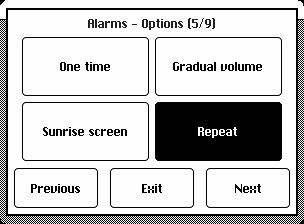 | 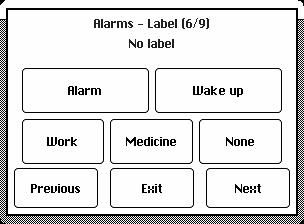 |

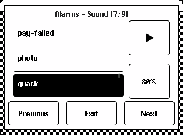

The alarm page shows the next scheduled alarm. A one-time alarm turns itself
off after it has rung.

When an alarm rings:

- Press **Alarm**, touch the top sensor, or select **Snooze 9 min** to snooze.
- Press **Clock** or select **Dismiss** to stop it.

## 9. Timer

1. Press **Alarm** on the clock.
2. Select **Timer**.
3. Adjust the duration with **-10**, **-1**, **+1**, and **+10**.
4. Select **Start**.

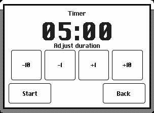

The timer keeps running while the clock is displayed. Its remaining time
replaces the date. When it finishes, select **Dismiss** or press Clock or
Alarm.

## 10. Hourly Chime

Open the pages under **Sound** to choose:

- No chime, an hourly chime, or a quarter-hour chime.
- The chime sound.
- The volume.
- Quiet hours during which no chime plays.

| Schedule | Sound | Volume | Quiet hours |
| --- | --- | --- | --- |
| 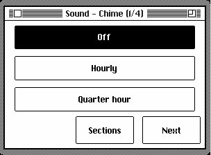 | 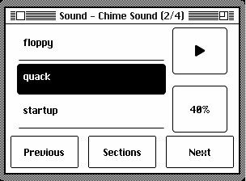 | 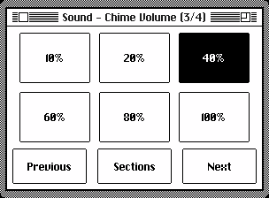 | 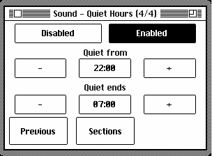 |

## 11. Wi-Fi and Weather

Wi-Fi is optional. The clock, alarms, timer, and local temperature display
continue to work without it.

### Connect to Wi-Fi

1. Open **System > Wi-Fi**.
2. Select **Setup Wi-Fi**.
3. Scan the QR code with your phone and follow the displayed instructions.
4. Select your network and enter its password.
5. Enter your city and country for local time and weather.
6. Save, then return to Maclock.

| Wi-Fi settings | Setup QR code |
| --- | --- |
| 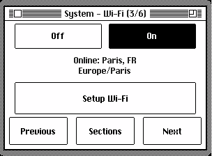 | 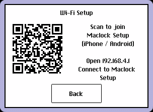 |

Once connected, Maclock can set its time automatically, display online
weather, check for updates, and provide its web control panel.

## 12. Web Control Panel

Use a phone or computer connected to the same network as Maclock. Open the
address shown by Maclock in **System > Tools > Diagnostics**.

On a computer, click an icon once to select it and double-click to open it. On
a touchscreen, tap once. Close the window or click outside it to return to the
launcher.

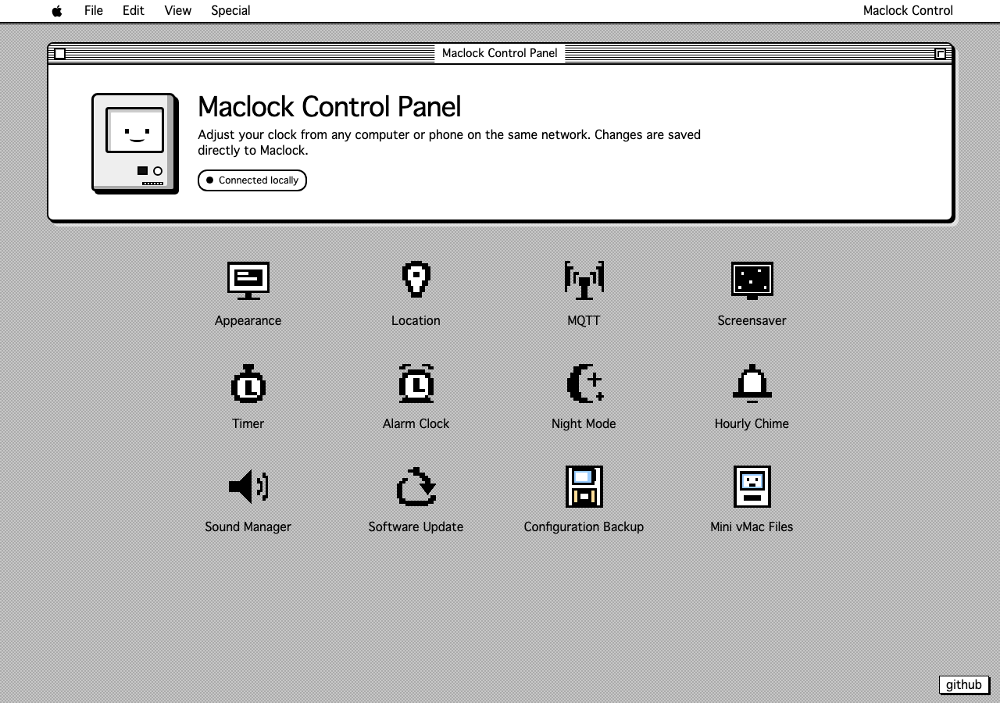

The control panel lets you manage appearance, location, screensavers, timers,
alarms, night mode, chimes, sounds, updates, backups, and emulator files.

If you close a window containing unsaved changes, choose whether to continue
editing or discard those changes.

### Add and manage sounds

Open **Sound Manager** to:

- Drag an MP3 into the window or choose one from your device.
- Import an MP3 from a web address.
- Search MyInstants.
- Preview sounds at different volumes.
- Remove sounds you previously added.

Built-in sounds remain available but cannot be removed.

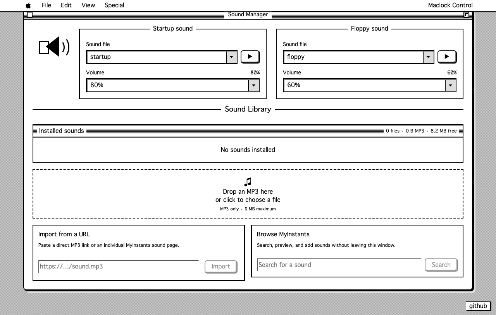

### Back up your settings

Open **Configuration Backup** to save a copy of your settings. Keep a recent
backup, especially before making many changes. The same application restores a
previous backup.

### Optional home automation

The **MQTT** application connects Maclock to compatible home-automation
systems. Enter the connection details supplied by your home-automation setup.
Maclock then appears as a device that can display notifications.

## 13. Software Updates

Maclock checks for updates when it is online. You can also open
**System > Software Update** or **Software Update** in the web control panel.

| Update settings | Available update |
| --- | --- |
| 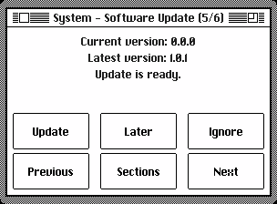 | 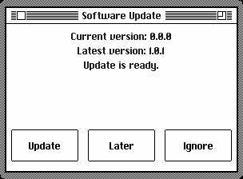 |

- Select **Update** to install the new version.
- Select **Later** to postpone it.
- Select **Ignore** to stop being reminded about that version.

Keep Maclock connected to power and Wi-Fi until the update has finished. A
progress bar shows the installation status. If an update is interrupted,
restart Maclock and leave it connected so it can continue.

Sounds and emulator files that you added are kept during normal updates. If
Maclock reports that it needs more space, remove unwanted sounds in Sound
Manager and try again.

## 14. Tools and About

Open **System > Tools** to view Diagnostics and maintenance options.
Diagnostics shows whether Maclock's main features are available and provides
useful information when asking for help.

| Tools | Diagnostics | About |
| --- | --- | --- |
| 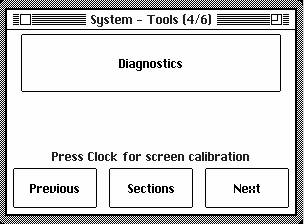 | 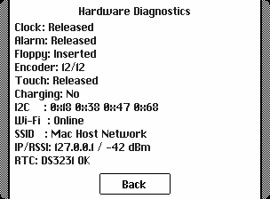 | 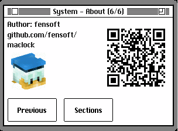 |

The **About** page shows the author and a QR code linking to the Maclock
project.

## 15. Macintosh Emulator

The emulator recreates a classic Macintosh on Maclock. It is available only
when the touchscreen is connected.

| About This Macintosh | MacPaint |
| --- | --- |
|  |  |

### Controls

- Drag a finger to move the pointer.
- Touch the top sensor to click.
- Clock acts as Enter.
- Alarm acts as Escape.
- Turn the rotary control to change brightness.

To leave safely, hold **Clock + Alarm** for two seconds. Always leave the
emulator this way before disconnecting power so your Macintosh files are saved
correctly.

### Manage emulator files

Open **Mini vMac Files** in the web control panel to back up, replace, or add
emulator files. Back up anything important before replacing it, then wait for
Maclock to confirm that the new file is installed.

Use only software that you are legally entitled to use.

## 16. Touchscreen Calibration

Calibrate the touchscreen if taps no longer match the displayed controls.

1. Open Configuration.
2. Press Clock again.
3. Touch and release each crosshair in order.

After the fourth crosshair, Maclock saves the calibration and returns to the
clock. Press Clock during calibration to cancel without saving.

